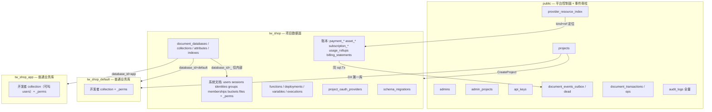
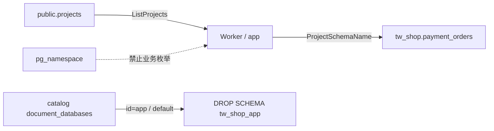
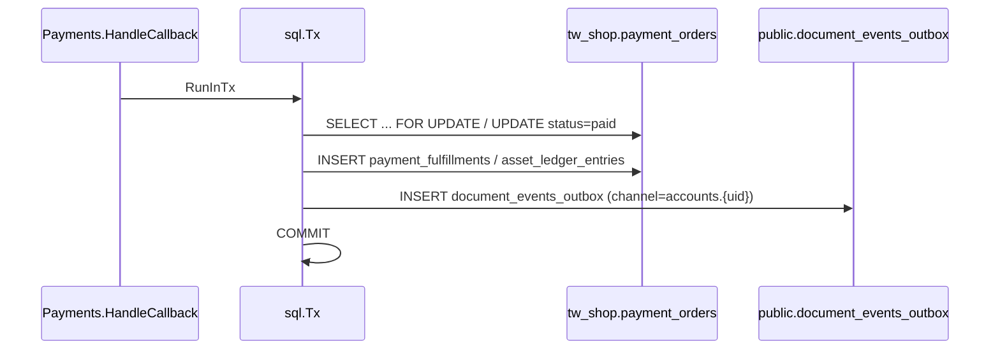
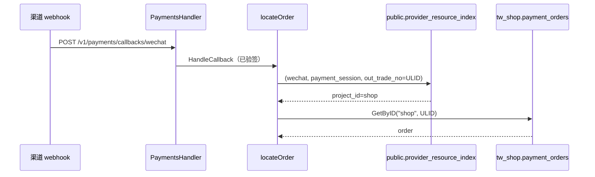
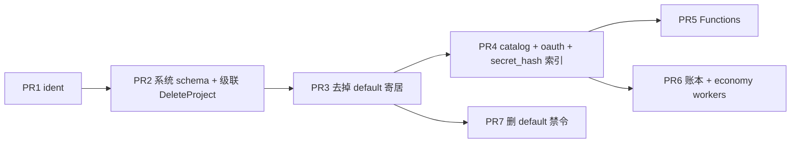

# 项目数据面 Schema（`tw_<project>`）

> 作者：待定  
> 日期：2026-08-20  
> 状态：**Draft**（代码审查修订完成；K14/K15/K17/K12 关键取舍已由 owner 裁决，待终审）  
> 修订：2026-08-20 按代码审查结论：修正事实引用与文件路径；补齐遗漏（`PruneOldExecutions`、`ListProjectIDsInRange`、go:embed、§8.2 清单等）；钉死排空型 worker 语义（K22）；Stripe metadata 写入升为必做；CreateProject 第一库 id 参数化（K23）；PR8 改为条件执行（系统表化另案既定，见 §「与系统表化的衔接」）。  
> 修订2：2026-08-20 owner 决策落地——`api_keys` / `audit_logs` 按 K14 规则重裁**留 public**（作废 `api_key_lookup` 方案，改为 `UNIQUE(secret_hash)` 全局索引 + 仓储 projectID 谓词）；PR8 移除（`_tenant` 全保留）；K8 新增项目 DDL 纪律与规模触发点；补 schema≠安全边界、单项目导出/导入收益、跨 schema FK 恢复顺序、平台聚合出路。  
> 前置：`docs/design/schema-naming.md`（已实施）、`docs/design/v3-payments-economy.md` D1、`docs/developer/06-databases.md`、`docs/design/v2-events-realtime-transactions.md`

---

## Overview

Torchwood 今天把**产品身份（project）**和**物理容器**绑错了：schema-per-database（`tw_<project>_<database>`）把系统文档集合（users / sessions / identities / groups / memberships / buckets / files）塞进名为 `default` 的业务库（`tw_shop_default`），经济账本与 Functions 又放在 `public` 里靠 `project_id` 列隔离。结果是：`DeleteDatabase("default")` 会误伤账号与存储；经济表与文档权限模型无关却和平台脊柱挤在同一 schema；运维无法按项目精确 DROP。

本方案引入**三层物理模型**：`public` 只保留平台控制面与事件脊柱；每个项目一个数据面 schema `tw_<project>`，容纳系统文档集合（仍是文档：`_perms` + DSL，不改成 bun 静态表）以及项目账本 / Functions / 文档目录；每个开发者 database 一个业务文档面 `tw_<project>_<database>`，只放用户 collection。`default` 降级为 CreateProject 自动创建的普通第一库，允许删除与重建。经济 D1 修正为「必须非文档 / 非业务 database schema」，不再要求必须落在 `public`。

> **过渡态声明**：users / buckets / files 等系统集合保持文档形态（`_perms` + DSL）是**临时决策**——后续将另行迁移为系统表并重写 ACL。本方案只搬物理位置（schema），不改表形态，两者正交；衔接与退役清单见 §「与系统表化的衔接」。

---

## Background & Motivation

### 当前物理布局

```text
public                          平台元数据 + 项目账本 + 事件脊柱（混居）
  projects, admins, api_keys, admin_projects, audit_logs
  document_databases / collections / attributes / indexes
  document_events_outbox (+ dead), document_transactions (+ ops)
  payment_*, asset_*, subscription_*, usage_rollups, billing_statements
  functions, function_deployments, function_variables, function_executions

tw_shop_default                 被当成「系统空间」
  users, sessions, identities, groups, memberships, buckets, files
  _perms
  （以及开发者若在 default 里建的业务 collection）

tw_shop_app                     真正的业务库
  posts, ...
  _perms
```

关键代码：

| 现状 | 位置 |
|------|------|
| `ident.SchemaName(project, database) → tw_<p>_<db>` | `pkg/ident/ident.go` |
| `IsSystemCollection` = `databaseID == "default"` ∧ 名单 | `internal/domain/databases/system_collections.go` |
| `EnsureSystemCollections` 固定 `dbID := "default"`，建 `tw_<p>_default` | `internal/infra/documentdb/postgres.go` `EnsureSystemCollections` |
| `CreateDatabase` / `DeleteDatabase` 拒绝 `default` | `internal/app/server/databases.go:57-90` |
| `DeleteDatabase` **不**调用 `ValidateSchemaResourceID`，只禁 `default`（app 层；adapter 经 `ident.SchemaName` 间接校验） | `databases.go:83-96` |
| 集合/文档入口用 `ValidateIdentifier` = `^[a-zA-Z_][a-zA-Z0-9_]*$`（**允许 `_`**） | `databases.go:18, 102-106` |
| Account / Storage / Groups / Auth 硬编码 `"default"` | 见 §8.2 清单 |
| 经济表 `public.payment_orders` 等 | `db/migrations/000013`–`000017`；bun model 无 schema 限定 |
| Worker 扫单表：`CloseExpired` / `ListExpired` / `ListDueForBilling` | `cmd/worker/*`、`internal/infra/bun/bunrepo/{payments,assets,subscriptions}_repo.go` |
| Worker 扫单表（续）：`RecoverOrphanExecutions` 与 `PruneOldExecutions` 全局无项目谓词（后者每次同步执行触发） | `bunrepo/function_repo.go:228-258`；`app/functions/executions.go:153` |
| 月账单 `upsertMonth` 经 `ListProjectIDsInRange` 跨项目 DISTINCT 扫 `usage_rollups` | `bunrepo/billing_repo.go:138-154`；`app/billing/billing.go:170-204` |
| `api_keys.secret_hash` 无索引，认证热路径顺序扫描 | `db/migrations/000001`（仅 `idx_api_keys_project`） |
| Stripe 一次性支付 metadata 只有 `order_id`、无 `project_id`；归一化侧不读 `metadata["project_id"]` | `internal/infra/payments/stripe/stripe.go:80-81, 277-301` |
| 订单 INSERT 在事务外（裸连接），翻 paying 靠乐观并发 | `app/payments/orders.go:103, 135-150`；`app/subscriptions/subscribe.go:243` |
| `EnsureSystemCollections` 懒调用（18+ 入口；billing 每小时为全部项目重跑），靠进程内缓存幂等 | `infra/documentdb/postgres.go:1374-1439`；`app/billing/billing.go:100-105` |
| `cleanupKeysWritePerms` 的 catalog UPDATE 横跨**所有项目**的 default 库行 | `postgres.go:1473-1475` |
| 无项目头定位：`locateOrder` 先 `GetByID("", event.OrderID)`（微信/支付宝 `out_trade_no` = 本地 ULID，**国内主路径**），再 `GetByProviderRef("", …)`；订阅 `GetByIDForUpdate("")`（本地 ID）与 `GetByProviderSubIDForUpdate` 均无项目；iOS `VerifyReceipt` 三次空 projectID | `payments/callback.go:269-281`；`payments_repo.go:77-85` `projectID==""` 不滤；`internal/infra/payments/wechat/wechat.go` / `alipay/alipay.go` `out_trade_no`；`subscriptions/hosted.go:63,69`；`receipt.go:52,104,128` |
| `DeleteProject` 只删 `public.projects` 行 | `bunrepo/project_repo.go:73-76`；setup 回滚同病 |
| 全局 migrate 仅 CLI `task migrate`；进程内无 golang-migrate 库；`db/` 不被任何二进制 embed；SQL 驱动为 bun/pgdriver | `Taskfile.yml`；`internal/infra/clients/database.go`；`internal/testutil/db.go` |

### 痛点

1. **产品身份 ≠ 物理容器。** 项目是租户边界，系统用户/文件/组是项目级资源，却寄居在一个叫 `default` 的 database 里。这是为兼容 Appwrite「系统集合必须在 default 库」的假寄居，Appwrite 不是本仓库宪法。
2. **`DeleteDatabase("default")` 不安全。** 今日禁令（`default database cannot be deleted`）是因为 DROP SCHEMA `tw_shop_default` CASCADE 会干掉 users/files。禁令本身证明模型错了：一个「业务库」删不得。
3. **经济 D1 过拟合到 `public`。** D1 的真实约束是「账本拒绝文档权限模型」（不是 `_perms` 文档、不是 DSL 直写），不是「必须和 outbox 同 schema」。跨 schema 单 `sql.Tx` 在同一 PG 实例内本来就可行（v3 D2 已承认）。把订单塞进 `public` 让所有项目的钱挤在一张表，DeleteProject 只能按 `project_id` 扫行，无法 DROP SCHEMA。
4. **schema 命名的 LIKE 陷阱已经存在，本方案会加剧。** `tw_shop`（新）与 `tw_shop_app`（旧）前缀重叠。运维若 `nspname LIKE 'tw_shop%'` 会误伤 `tw_shopx` / `tw_shop_app`。必须精确匹配，禁止扫 `pg_namespace` 做业务枚举。已实施的 `schema-naming.md` 仍写「运维可 `LIKE 'tw_%'`」和「`tw_` 之后有且仅有一道 `_`」，落地后必须改宪法文档。
5. **Catalog 把系统集合挂在 `database_id='default'`。** `document_collections.is_system` 回填（migration `000009`）与 `cleanupKeysWritePerms` 的 `WHERE database_id = 'default'`（且 **无 `project_id` 谓词**）都写死了这条假设。

---

## Goals & Non-Goals

### Goals

1. 落地三层物理模型：`public` / `tw_<project>` / `tw_<project>_<database>`。
2. 系统文档集合迁到 `tw_<project>`，**仍是文档**（`_perms` + `pkg/query` DSL + `EnsureSystemCollections` spec），不改成 bun 静态表。
3. 项目账本、Functions、文档目录迁到 `tw_<project>`；平台脊柱留在 `public`。
4. `default` 变为 CreateProject 自动创建的普通业务库：可删、可重建、不再寄居系统集合。第一库 id 来自 **CreateProject 命令参数**（bootstrap 由超管填写，缺省 `default`，见 K23 / §4.1）。
5. `DeleteDatabase("default")` 只 DROP `tw_<project>_default` 里的用户 collection，绝不能碰到 `tw_<project>.users` / `files`。**Create/DeleteDatabase 永不把任何 id 解析成 `ProjectSchemaName`。**
6. 系统文档表去掉 `_tenant` 列，主键改为 `_id`。业务库 `_tenant` **本期保留**。
7. Worker 从 `public.projects` 枚举项目再查 `tw_<id>`，不扫 `pg_namespace`；枚举在 app/`cmd/worker`，不在 bunrepo。
8. 修正 v3 D1 表述：账本必须非文档、非业务 database schema；物理上与系统文档同居项目 schema。

### Non-Goals

- 不把 users / files / groups 改成 bun 静态表，不重写 `_perms` 语义。**这是临时决策，不是永久立场**：系统表化 + ACL 重写是既定后续另案，本方案只搬物理位置（见 §「与系统表化的衔接」）。
- 不在本期去掉业务库 `tw_<project>_<database>` 的 `_tenant`（另案）。
- 不为 Appwrite 兼容保留任何「假 database」寄居系统集合。
- 不引入跨实例 / 跨 PG database 的分库（仍是同一 PostgreSQL database 内的 schema）。
- 不改 collection / attribute / index 的 charset，不改 Realtime 用户集合频道格式。
- 不把 outbox / document_transactions 迁出 `public`（事件脊柱、跨项目 worker 领取）。
- 不做在线零停机的精细回滚演练之外的双写长期共存（开发期可重建；生产给迁移草图）。
- 不把 `admins` / `projects` 迁出 `public`。
- 不清理 MinIO 对象与 Redis 残留（functions 队列待执行消息、OTP 码、限流键）——DeleteProject 的已知缺口，另案处理。
- 不在进程内引入 `github.com/golang-migrate/migrate/v4` 作为项目 DDL 引擎。

---

## Key Decisions

| ID | 决策 | 选择 | 理由 |
|----|------|------|------|
| K1 | 三层物理模型 | `public` 控制面 + 脊柱；`tw_<project>` 项目数据面；`tw_<project>_<database>` 业务文档面 | 产品身份（project）对应物理容器；database 只装开发者 collection |
| K2 | 系统集合形态 | 仍是文档（`_perms` + DSL + spec），只换 schema | 表形态迁移（系统表化 + ACL 重写）是**已定后续另案**；本方案只搬物理位置，不叠加两次重写 |
| K3 | `default` 角色 | 普通业务库，CreateProject 自动建；可删可重建 | DX 约定第一库名；不再是系统空间 |
| K4 | 系统集合寻址 | `ident.ProjectDataPlaneID = "_"`（非法 SchemaResourceID）；物理表在 `tw_<project>` | 不是假 database：不建 `tw_<p>_` schema。charset **不够**：对外 database_id 必须 `ValidateSchemaResourceID` **且**显式拒绝 sentinel；Create/DeleteDatabase **禁止**走 sentinel 分支 |
| K5 | 业务库同名 collection | **允许** `tw_shop_app.users` 作为普通用户集合 | 系统性由「所在 schema」决定，不由 collection id 决定 |
| K6 | `IsSystemCollection` | `databaseID == ident.ProjectDataPlaneID && IsSystemCollectionID(id)`；**不再**要求 `== "default"` | 业务库 `default`/`app` 的同名表不是系统集合 |
| K7 | 经济 D1 修正 | 账本必须非文档、非业务 database schema；物理上同居 `tw_<project>` | 拒绝 `_perms` 攻击面的约束不变；「必须 public」是过拟合 |
| K8 | 项目 bun 表 DDL | `internal/infra/projectschema/migrations/*.sql`（包内 go:embed）+ 每 schema `schema_migrations`；**当前 `sql.Tx` 上 `Exec` 带 `quoteIdent`**，不引入 golang-migrate 库 | 与 documentdb DDL 同构；CreateProject 必须能整单回滚；库不在进程内 |
| K9 | 运行时 SQL | **禁止**在连接池上 `SET search_path`；一律 `quoteIdent(schema).table` | 池化连接串租户会串 schema。CreateProject 同 Tx 也不靠池级 search_path |
| K10 | Worker 枚举 | `public.projects` 列出 id，再查 `tw_<id>`；循环在 **app / `cmd/worker`**；禁止 `pg_namespace` | LIKE 陷阱；目录是权威；bunrepo 不依赖项目目录 |
| K11 | 跨 schema 事务 | 同一 `sql.Tx` 写 `tw_shop.payment_orders` + `public.document_events_outbox` | 已是 v2/v3 既有能力；PG 跨 schema FK 合法 |
| K12 | 系统表 `_tenant` | **保留**（原 PR8 已移除，owner 2026-08-20）；待系统表化整表重写时自然消失 | 表形态是过渡态：先 DROP COLUMN 再整表重写是三连迁移；保留代价只是一列 + 建表 DEFAULT + 恒真谓词，无正确性影响 |
| K13 | 业务表 `_tenant` | 本期保留，另案再去 | 查询形状、OCC、advisory lock、导入 remap 爆炸半径太大 |
| K14 | public 留表判据（**规则化**） | 需要「**无项目上下文访问**」或「**项目 schema Ensure 之前访问**」的表留 public：`admin_projects`、`api_keys`、`audit_logs`、`provider_resource_index`；其余项目资源迁 `tw_<project>` | 控制面不得依赖项目 schema 已 Ensure。`api_keys` / `audit_logs` 原拟迁入，按此规则重裁**留 public**（owner 2026-08-20） |
| K15 | `api_keys` | **留 public**（按 K14 规则重裁；原「迁入 + `api_key_lookup`」方案作废） | 认证热路径只有 hash、无项目上下文——控制面。补救（PR4）：全局迁移 `UNIQUE(secret_hash)`（今日**无索引**，热路径顺序扫描）+ `GetAPIKey`/`DeleteAPIKey` 仓储补 `project_id` 谓词 |
| K16 | 无项目头路由 | `public.provider_resource_index (provider, kind, provider_ref) → project_id`；`kind ∈ {payment_session, payment_order, subscription, ios_transaction}`。**`locateOrder` 只走 index → 带 projectID 的 Get**；domain 端口禁止 `projectID==""`。本地 ULID 在 INSERT 订单同事务写入 `kind=payment_session, ref=order.ID`（覆盖微信/支付宝 `out_trade_no`） | 今日国内主路径是 `GetByID("", OrderID)`；分 schema 后空 project 无法选 schema，禁止扫全项目（K10） |
| K17 | `audit_logs` | **留 public**（项目行 + 平台行同表，`project_id` 区分；原「拆入项目 schema」方案作废） | 写点是全局拦截器 best-effort（`pkg/grpc/interceptor/audit.go`），按项目路由会徒增复杂度；跨项目审计天然可查；DeleteProject 已按 `project_id` 清理 |
| K18 | 系统集合不进文档 outbox | 维持 v2 | Users/Storage 高频写；经济走 `accounts.{uid}`；不新增 `databases._.collections.*` 频道 |
| K19 | Appwrite 兼容 | 不做 | 不为假 default 寄居保留任何兼容层 |
| K20 | 账本迁表与 Worker | 无存量环境禁止双读 flag；**账本切片与 economy worker 同一合并窗口**（PR6）。有存量再引入 `TORCHWOOD_PROJECT_LEDGER_SCHEMA` | 表迁走而 Closer 仍扫 public 会漏关单 |
| K21 | 回调未命中 | 验签成功、actionable、**携带本平台会写入的 ref** 但 index 未命中 → `ErrProviderIndexMiss` → HTTP **503** + 渠道 FAIL 体（勿走 `CallbackAck(true)`）。无任何我方 ref（Stripe 账号噪音）→ **200** + 日志，避免重试风暴。`ignored` 仍 200。handler 把 miss 从「其它错误 → `CallbackAck(false)`（500）」里拆出 | 早到 webhook 要重试；无关 PI 不能 503 三天 |
| K22 | Worker 全局预算 | 每 tick **全局**上限（关单 500、过期 500、账单 100）；foreach 项目时扣减 remaining，禁止 per-project 再传同一 limit。**排空型 worker（AssetExpirer / SubscriptionBiller 今日为循环排空）统一改为全局预算**：预算用尽即结束本 tick，下一 tick 带 cursor 继续 | 避免 500×项目数；排空 × 项目数会在单 tick 内爆炸 |
| K23 | CreateProject 第一库 id | 来自命令参数 `FirstDatabaseID`（缺省 `default`）；bootstrap `SignUp` 把超管填写的 database id 透传 | 首个超管注册已支持填写 project/database id（`console/setup.go:107-108`）；写死 `"default"` 与现状不符 |

---

## Proposed Design

### 1. 三层物理模型



#### 1.1 `public`：平台控制面 + 事件脊柱

只放**没有单一项目上下文、或必须跨项目领取**的表：

| 表 | 理由 |
|----|------|
| `projects` | 项目登记；Worker / 认证 / Console 的枚举源 |
| `admins` | 平台管理员，不属于任一项目 |
| `admin_projects` | admin↔project 授权。今日查询形状是 `HasProjectAccess(adminID, projectID)` **等值点查**（`admin_project_repo.go`）；`ListProjects` 对非平台 admin 直接空列表。留 public 不是因为「现在就能 JOIN 所有项目」，而是控制面：bootstrap `GrantProjectAccess` 与未来「我的项目」不得依赖 `tw_<project>` 已 Ensure |
| `api_keys` | API Key 凭据；认证热路径只有 secret_hash、无项目头——按 K14 规则**留 public**（PR4 补 `UNIQUE(secret_hash)`，今日无索引） |
| `provider_resource_index` | `(provider, kind, provider_ref)` PK → `project_id`；支付 / 托管订阅 / iOS 无项目头 |
| `document_events_outbox` / `document_events_outbox_dead` | OutboxWorker 跨项目领取（v2） |
| `document_transactions` / `document_transaction_ops` | 事务元数据按 `(created_by, project_id, database_id)` 约束；Worker/过期扫描跨项目；**database_id 不得为 `_`**（系统集合不进事务，v2 已定；Create 入口必须拒 sentinel） |
| `audit_logs` | **全量**（项目行 + 平台行，`project_id` 区分）；写点是全局拦截器、best-effort——按 K14 规则**留 public**，无需按项目路由 |

`projects.internal_id` 仍存在，继续服务业务库 `_tenant`（本期不删）。

#### 1.2 `tw_<project>`：项目数据面

`ident.ProjectSchemaName("shop") → "tw_shop"`（一段式，见 §2）。

容纳：

1. **系统文档**（仍走 `DocumentDB`）：`users` `sessions` `identities` `groups` `memberships` `buckets` `files` + `_perms`
2. **项目账本**（bun，非文档）：`payment_orders` `payment_callback_events` `payment_fulfillments` `asset_defs` `asset_holdings` `asset_ledger_entries` `subscription_plans` `subscriptions` `usage_rollups` `billing_statements`
3. **Functions**（bun）：`functions` `function_deployments` `function_variables` `function_executions`
4. **项目 OAuth 配置**（bun）：`project_oauth_providers`（`api_keys` / `audit_logs` 按 K14 规则留 public，见 §1.1）
5. **文档目录**（bun）：`document_databases` `document_collections` `document_attributes` `document_indexes`
6. **DDL 版本表**：`schema_migrations`

#### 1.3 `tw_<project>_<database>`：业务文档面

保持 `ident.SchemaName(project, database)` 两段式。只放开发者 collection 与该库的 `_perms`。**没有**系统集合。`default` 与 `app` 同等：一个 catalog 行 + 一个 PG schema。

本方案顺带补全 `schema-naming.md` 的初衷：**单项目物理导出/导入**从此可行——`pg_dump -n tw_<project> -n tw_<project>_<db> ...` + `public.projects` 行。恢复顺序受跨 schema FK 约束：先建项目行（含 Ensure）再恢复 schema（见 §6.2）。

### 2. 命名：`ProjectSchemaName` 与 LIKE 陷阱

#### 2.1 `pkg/ident` 增量

```go
// pkg/ident/ident.go

const ProjectDataPlaneID = "_" // 非法 SchemaResourceID；仅内部寻址项目数据面

var projectSchemaNameRe = regexp.MustCompile(`^tw_[a-z][a-z0-9]{0,27}$`)

func ProjectSchemaName(projectID string) (string, error) { /* tw_{id}；校验 projectID */ }

func SchemaName(projectID, databaseID string) (string, error) {
    // 现有两段式不变。
    // "_" 无法通过 ValidateSchemaResourceID，SchemaName 自然失败。
}

// IsTwoSegmentSchema 供 DeleteDatabase 硬断言：目标必须匹配 schemaNameRe。
func IsTwoSegmentSchema(name string) bool { return schemaNameRe.MatchString(name) }
```

长度：`tw_`(3)+28 = **31** 字节，远低于 `NAMEDATALEN-1=63`。两段式仍为 60。

单测补（相对今日 `ident_test.go`）：

| 输入 | 输出 |
|------|------|
| `ProjectSchemaName("shop")` | `tw_shop` |
| `ProjectSchemaName("default")` | `tw_default` |
| `SchemaName("shop","app")` | `tw_shop_app` |
| `ValidateSchemaResourceID("_")` | **error**（今日非法表未列 `_`，PR1 必须补） |
| `SchemaName("shop","_")` | error，空串 |
| `projectSchemaNameRe.MatchString("tw_shop_app")` | **false** |
| `IsTwoSegmentSchema("tw_shop")` | false |
| `IsTwoSegmentSchema("tw_shop_default")` | true |

#### 2.2 LIKE 陷阱（运维必须精确匹配）

项目 id **不含 `_`**（`^[a-z][a-z0-9]{0,27}$`），因此：

| 模式 | `tw_shop` | `tw_shop_app` | `tw_shop_default` | `tw_shopx` | `tw_shopx_default` |
|------|-----------|---------------|-------------------|------------|---------------------|
| `= 'tw_shop'` | ✓ | | | | |
| `LIKE 'tw_shop%'` | ✓ | ✓ | ✓ | ✓ **误伤** | ✓ **误伤** |
| `LIKE 'tw_shop_%'` | | ✓ | ✓ | | |
| `LIKE 'tw_shop\_%' ESCAPE '\'` | | ✓ | ✓ | | |
| `LIKE 'tw_%'` | ✓ | ✓ | ✓ | ✓ | ✓ |

规则：

1. **项目数据面**：`nspname = ident.ProjectSchemaName(id)`（等值，禁止 LIKE）。
2. **某项目的业务库**：权威是 catalog，不是 namespace。运维若必须扫 PG：`nspname LIKE ident.ProjectSchemaName(id) || '\_%' ESCAPE '\'`。
3. **DeleteProject / 运维脚本禁止** `LIKE 'tw_' || id || '%'`。
4. **Worker / 业务代码禁止扫 `pg_namespace`。** 业务库列表的权威是 catalog（PR4 前 `public.document_databases`，之后 `tw_<project>.document_databases`）；项目列表的权威是 `public.projects`。
5. **`LIKE 'tw_%'` 仅允许作为「本实例全部 Torchwood 动态 schema」的运维扫描**，并写明会同时命中一段式与两段式。不得当「某项目」过滤器。
6. **SQL `LIKE` 里 `_` 是单字符通配。** catalog / AIP-160 filter 禁止把未转义的 `ProjectDataPlaneID` 当 LIKE 操作数。日志打印 `schema=tw_shop`，不要把 `database_id=_` 打进可能被拼进 LIKE 的字段。

**PR1 必须改 `docs/design/schema-naming.md`：**

- §2「运维可 `LIKE 'tw_%'`」改为上表第 5 条。
- §3.2「`tw_` 之后有且仅有一道 `_`」改为：一段式 `tw_{project}` 恰好一道（前缀后）；两段式恰好两道。
- 业务库枚举用 catalog，禁止 `LIKE 'tw_'||id||'%'`。



### 3. 系统集合仍是文档，只换 schema

`internal/domain/databases/system_collections.go`：

```go
func IsSystemCollection(projectID, databaseID, collectionID string) bool {
    return databaseID == ident.ProjectDataPlaneID && IsSystemCollectionID(collectionID)
}
```

#### 3.0 Schema 解析分叉（P0：DDL 永不映射一段式）

**禁止**把 sentinel 特判放进 CreateDatabase / DeleteDatabase 共用的解析函数。今日二者都走 `tenantAndSchema` → `ident.SchemaName`，`"_"` 因 charset 失败才没被 DROP。本方案若在共用函数里把 `"_"` 映射成 `tw_shop`，`DeleteDatabase("_")` 会变成 `DROP SCHEMA "tw_shop" CASCADE`。

```go
// documentSchema：文档读写 / EnsureSystemCollections / CreateCollection。
// 仅此处允许 sentinel → ProjectSchemaName。
func (p *postgresDocumentDB) documentSchema(ctx context.Context, projectID, databaseID string) (int64, string, error) {
    internalID, err := p.resolveInternalID(ctx, projectID)
    if err != nil {
        return 0, "", err
    }
    if databaseID == ident.ProjectDataPlaneID {
        schema, err := ident.ProjectSchemaName(projectID)
        return internalID, schema, err
    }
    schema, err := ident.SchemaName(projectID, databaseID)
    return internalID, schema, err
}

// CreateDatabase / DeleteDatabase：只许两段式。
func (p *postgresDocumentDB) businessSchema(projectID, databaseID string) (string, error) {
    if databaseID == ident.ProjectDataPlaneID {
        return "", status.Error(codes.InvalidArgument, "database_id is reserved")
    }
    schema, err := ident.SchemaName(projectID, databaseID)
    if err != nil {
        return "", err
    }
    if !ident.IsTwoSegmentSchema(schema) {
        return "", status.Error(codes.Internal, "refusing to DDL a non two-segment schema")
    }
    if one, err := ident.ProjectSchemaName(projectID); err == nil && schema == one {
        return "", status.Error(codes.Internal, "refusing to DROP/CREATE project data-plane schema")
    }
    return schema, nil
}
```

`DeleteDatabase` 的 `DROP SCHEMA` **只**吃 `businessSchema` 的返回值。集成测试见 §4.2 / PR2。

`EnsureSystemCollections`：

1. `CREATE SCHEMA IF NOT EXISTS tw_shop`（`ProjectSchemaName`）。
2. 确保 `tw_shop._perms`（与 `tw_shop_default._perms` 不是同一张表）。
3. **不再** `INSERT document_databases(id='default')`，**不再** `SchemaName(project,"default")`。
4. 幂等插入 catalog-only 行 `document_databases(id='_')`（§3.1；**复合 PK `(project_id, id)`，以 migration `000003` 为准**，每项目一行，不撞全局 PK），然后 `CreateCollection(project, "_", "users", …)`。
5. `cleanupKeysWritePerms`：`WHERE project_id = ? AND database_id = '_' AND id IN (...)`（**现在就加 `project_id`**，不要等 catalog 迁走）。PR4 catalog 迁入后改为 `ModelTableExpr("?.document_collections", projectSchema)`。
6. `isWriteProtectedSystemCollection` 看 `ProjectDataPlaneID`。
7. `CreateCollection` adapter：`databaseID == ProjectDataPlaneID` 时 **只允许** `IsSystemCollectionID(collectionID)`，否则错误。普通 `posts` 不得建在项目数据面。

Catalog 的 `is_system=true` 只出现在 `database_id='_'` 的行。migration `000009` 的回填语义由运行时 reconcile 接替（不改已发布的 migration 文件）。

系统集合 **仍然**：

- 无 `_version` 列（`createCollectionTable(..., isSystem=true)`）
- 不写 `document_events_outbox`（v2）
- 不进 `document_transactions`（`ErrSystemCollectionNotAllowed`；Create 还要拒 `database_id="_"`）
- Server / Client Databases **API** 摸不到它们（§8.1）

#### 3.1 Catalog sentinel `_` 不是假 database

| | 今日 `default` | 本方案 `_` |
|--|----------------|-----------|
| PG schema | 有 `tw_shop_default` | **无** `tw_shop_` / `tw_shop__` |
| ListDatabases（API） | 出现 | **use-case 过滤** `id='_'`；GetDatabase 对外 NotFound |
| CreateDatabase | 拒绝（特殊禁令） | charset + 显式 sentinel + `businessSchema` 三层拒绝 |
| DeleteDatabase | 拒绝（怕误伤系统表） | 同上；即使绕过 use-case，infra 也拒绝 DROP 一段式 |
| 物理表位置 | 与业务 collection 同 schema | `tw_shop.users` |
| 用户可见 | Console Databases 页列出系统集合 | 只走 Users / Storage / Groups 专用页 |

`document_collections.database_id` 仍 REFERENCES `document_databases(project_id, id)`。PR2–PR3 catalog 仍在 `public` 时，sentinel 按项目各插一行（`000003` 复合 PK）。catalog 迁入 `tw_<project>` 后是同 schema FK。该行 `name` 固定 `"(project)"`。

不把 `database_id` 改成 NULL：PG 复合主键列不能为 NULL。

Infra 的 `ListDatabases` / `GetDatabase` 可以看见 sentinel（供 Ensure reconcile）。**use-case / gRPC 必须过滤**：List 去掉该行，Get(`"_"`) → `NotFound`（或 `InvalidArgument`；锁定 **InvalidArgument**，与 charset 失败一致，避免存在性探测）。

sentinel 是**验证式**不变式（charset + 显式拒绝 + 测试守住），不是类型式（专用端口让 `_` 不可表示）。过渡态接受验证式——真正的结构性保险是 §3.0 的 DDL 分叉（Create/DeleteDatabase 永远拿不到一段式名字）；系统表化落地时 sentinel 整体退役（见 §「与系统表化的衔接」）。

#### 3.2 业务库允许同名 collection

`CreateCollection(shop, "app", "users", ...)`：`IsSystemCollection` 为 false → 普通用户集合，有 `_version`，发文档 outbox，频道 `databases.app.collections.users`。物理表 `tw_shop_app.users`，与 `tw_shop.users` 无关。

`CreateCollection(shop, "default", "users", ...)` 在系统集合迁走后同样合法。

### 4. CreateProject / DeleteProject / default 库

#### 4.1 CreateProject 序列

今日（`CreateProjectInternal`）：`RunInTx` 里 `INSERT projects` + `EnsureSystemCollections`（`clients/tx.go` 把 `bun.Tx` 放进 ctx）。

改造后，**仍是同一 `RunInTx`**（无独立连接、无 golang-migrate driver）：

```text
CreateProject(id=shop)  -- 同一 bun.Tx
  1. INSERT public.projects
  2. CREATE SCHEMA tw_shop
  3. projectschema.Apply(tx, "shop")     -- 当前 Tx 执行 SQL 文件 + 写 schema_migrations
  4. EnsureSystemCollections(shop)       -- tw_shop.users 等 + catalog database_id='_'
  5. docDB.CreateDatabase(shop, firstDBID, firstDBID)  -- infra，两段式
       CREATE SCHEMA tw_shop_<firstDBID>
       ensurePermsTable
       INSERT catalog document_databases(id=<firstDBID>)
```

任一步失败 → 外层 ROLLBACK：schema、表、系统集合、`public.projects` 一并消失。

`CreateDatabase("default")` 的 **use-case 禁令**在 PR7 解除；此前 CreateProject 内部调 **infra** `docDB.CreateDatabase`。

`firstDBID` 来自 `CreateProjectCommand.FirstDatabaseID`（缺省 `"default"`）。今日 bootstrap `SignUp` 由超管填写 database id：等于 `"default"` 时依赖 Ensure 顺带建库，否则**再额外**调一次 use-case `CreateDatabase`（`console/setup.go:204-210`）。改造后 setup 直接把填写的 id 透传给 CreateProject，额外建库分支与 `defaultDatabaseID` 常量删除。`CreateProjectRequest` proto 是否暴露该字段在 PR2 决定（bootstrap 走内部命令，不依赖 proto）。

#### 4.2 DeleteDatabase("default")

`businessSchema` 只产生两段式：

```text
DeleteDatabase(shop, "default")
  DROP SCHEMA tw_shop_default CASCADE     -- 只掉该业务库
  DELETE catalog collections/attributes/indexes WHERE database_id='default'
  DELETE catalog document_databases WHERE id='default'
```

`tw_shop.users` / `files` / `payment_orders` **不受影响**。

验收（**PR2 起** 1–2 在 adapter 层就必须有，即使 use-case 仍禁删 default：测试直接调 `docDB.DeleteDatabase`）：

1. 建项目 → 有用户 → infra `DeleteDatabase(pid, "default")` → `GetUser` 仍成功；`to_regnamespace('tw_<pid>')` 非空，`tw_<pid>_default` 为空。
2. infra `DeleteDatabase(pid, "_")` **失败**，且 `tw_<pid>` 仍在。
3. **PR7** 再解禁 use-case，并补：再 `CreateDatabase("default")` 成功；业务库 `CreateCollection("users")` 且 `is_system=false`。

#### 4.3 DeleteProject（**PR2 落地**，不得拖到解禁 default）

今日 `projectRepo.DeleteProject` 只删行；setup 回滚同病。PR2 一开始就会 `CREATE SCHEMA tw_<project>`，若不级联，失败的 bootstrap 会永久泄漏一段式 schema。

规定顺序（同一事务）：

```text
DeleteProject(shop)   -- app 层；setup 回滚必须走这里，禁止只调 projectRepo.DeleteProject
  1. dbs = SELECT id FROM catalog.document_databases
           WHERE project_id='shop' AND id <> '_'
           -- PR4 前 catalog 在 public；之后在 tw_shop
  2. 对每个 db：DROP SCHEMA SchemaName(shop, db) CASCADE   -- businessSchema / 两段式
  3. DELETE public.document_events_outbox      WHERE project_id='shop'
     DELETE public.document_events_outbox_dead WHERE project_id='shop'
     DELETE public.document_transactions       WHERE project_id='shop'
     DELETE public.api_keys                   WHERE project_id='shop'
     DELETE public.provider_resource_index     WHERE project_id='shop'
     DELETE public.audit_logs                  WHERE project_id='shop'
     DELETE public.admin_projects              WHERE project_id='shop'
  4. DROP SCHEMA ProjectSchemaName(shop) CASCADE
  5. DELETE public.projects WHERE id='shop'
```

禁止 `LIKE 'tw_shop%'`。对外 DeleteProject RPC 仍按 roadmap 另做（Open Q3）；**setup 回滚与内部删除必须在 PR2 就走级联**。

已知缺口（另案，不在本方案内）：MinIO 对象不清理（files 元数据随 schema 消失、blob 成孤儿）；Redis 残留不清理（functions 队列待执行消息、OTP 码、限流键）。

### 5. 项目 schema 模板 DDL

全局 `db/migrations/`（CLI `task migrate`）**只服务 `public`**。进程内不引入 golang-migrate 库。

#### 5.1 机制（锁定）

```
internal/infra/projectschema/migrations/
  000001_catalog.up.sql
  000002_payments.up.sql
  000003_assets.up.sql
  000004_subscriptions.up.sql
  000005_usage_billing.up.sql
  000006_functions.up.sql
  000007_oauth.up.sql
```

> 目录放在包内而不是 `db/`：`go:embed` 不支持引用包目录之外的路径，而 server 与 worker 二进制都要跑 `EnsureAll`，SQL 文件必须打进二进制（今日 `db/` 不被任何二进制 embed，`task migrate` 是 CLI 从磁盘执行）。全局 `db/migrations/` 继续服务 `public`，两者互不影响。

`internal/infra/projectschema`（自研，风格对齐 documentdb 的 `ExecContext` + `quoteIdent`）：

```go
type Migrator struct{}

// Apply 在调用方已经打开的 tx 上执行待应用版本。
// CreateProject 传入 ctx 里的 bun.Tx；EnsureAll 自己 RunInTx。
func (m *Migrator) Apply(ctx context.Context, projectID string) error

func (m *Migrator) EnsureAll(ctx context.Context, projectIDs []string) error
```

`Apply` 流程：

1. `ValidateSchemaResourceID` + `ProjectSchemaName` + `quoteIdent`。
2. `pg_advisory_xact_lock($1, $2)`：`hashtext('tw_schema')` 与 `hashtext(projectID)` 两个 int4。锁随 **当前 Tx** 释放（COMMIT/ROLLBACK），不与 session 级 migrate 锁叠加（我们不用那个 driver）。
3. `CREATE SCHEMA IF NOT EXISTS <quoted>`（若尚未建）。
4. 确保 `<schema>.schema_migrations (version BIGINT PRIMARY KEY, dirty BOOLEAN NOT NULL, applied_at TIMESTAMPTZ)`。
5. 按版本读 `migrations/*.up.sql`（包内 embed），把占位符 `{{schema}}` 替换为 `quoteIdent(schema)`，在 **同一 Tx** `Exec`。引用平台表写 `public.projects(id)`。
6. 每文件成功后 `INSERT schema_migrations`。中途失败：CreateProject 路径靠外层 ROLLBACK；EnsureAll 路径标记 `dirty=true` 并返回错误，**不**在脏项目上继续跑后续版本。

执行约束：驱动是 **bun/pgdriver**（非 pgx / lib/pq）。无参数 `Exec` 走 simple protocol、可整文件多语句执行（`internal/testutil/db.go` 的 `runMigrations` 已有先例）——`Apply` 在替换 `{{schema}}` 后必须保持**零查询参数**，禁止占位符与 SQL 参数混用。

**项目 DDL 纪律**（`Apply` 在事务内 Exec、跨 N 个 schema 扇出，逐条硬约束）：
1. **`CREATE INDEX CONCURRENTLY` 不可用**（PG 禁止事务块内执行）。项目 DDL 只允许秒级操作：建表、加列（常量 DEFAULT，PG 11+ 为元数据级）、小表索引。
2. 大表索引 / 重写类变更**不进 project_migrations**。逃生通道：把该项目标 dirty（EnsureAll 跳过）→ 停写窗口或手工 `CREATE INDEX CONCURRENTLY` → 回填 `schema_migrations` 版本行 → 解除 dirty。流程留在文档里，不许临场发明。
3. 每个版本文件合入前评估**最差规模项目上的执行时长**；预计超过秒级即需 owner 评审。
4. **规模触发点**：schema-per-project 的舒适区是数百到数千项目。项目数 **> 5,000** 时重估分片/归并策略（pg_dump、监控工具、relcache、迁移扇出会集体退化）——这是本模型的已知天花板，不是失败信号。

**否决：**

- golang-migrate **库**：本仓库进程内没有该依赖；其 postgres driver `SchemaName` 会 `SET search_path TO <schema>`（**不含 public**），与「独立连接 + 同一 RunInTx」互斥，且另有一把 session 级 advisory lock。
- 纯 bun `NewCreateTable`：部分索引 / CHECK 写不清。
- 全局 `db/migrations/` 里 `CREATE TABLE tw_...`：CreateProject 时项目还不存在。

**down 文件：** 开发期重建靠 `task down && task up` 或 `DROP SCHEMA tw_<id> CASCADE`，**不要求**为每个 project_migrations 维护可在生产执行的 down。可保留 `.down.sql` 供本地单版本调试，Apply 热路径不跑 down。生产项目 DDL **只向前**。

#### 5.2 SQL 文件形态

```sql
-- internal/infra/projectschema/migrations/000002_payments.up.sql
-- 占位符 {{schema}} 由 Apply 替换为 quoteIdent(ProjectSchemaName(id))，例如 "tw_shop"。
-- 禁止未限定表名。

CREATE TABLE IF NOT EXISTS {{schema}}.payment_orders (
    id                  TEXT PRIMARY KEY,
    project_id          TEXT NOT NULL REFERENCES public.projects(id),
    user_id             TEXT NOT NULL,
    -- ... 与 000013 同结构（项目内 UNIQUE (provider, provider_order_id)）...
    CONSTRAINT payment_orders_idempotency UNIQUE (project_id, idempotency_key)
);

CREATE INDEX IF NOT EXISTS payment_orders_close_scan
    ON {{schema}}.payment_orders (expires_at)
    WHERE status IN ('created', 'paying');
```

`project_id` 列保留：防御、跨 schema FK、拆行迁移。schema 已隔离后它不再承担租户隔离主责。

同 schema 内 FK（`payment_fulfillments.order_id REFERENCES payment_orders(id)`）迁走后仍是 **同 schema**，不要误加成跨 schema。

#### 5.3 自愈

Server 与 Worker 启动：`ListProjects` → `EnsureAll`。

约束：

1. **并发上限 4** 个项目并行 Apply；整体有超时（建议 30s 软超时，超时项目记 failure 指标，不卡死进程）。
2. **Health check 不依赖 EnsureAll 完成**（解耦：先 listen，后台补 DDL）。
3. EnsureAll 覆盖 `public.projects` **全部行**（含未来 `suspended`）：只要项目行在，schema 就该在。Worker **扫描**跳过 `status != 'active'`（今日只有 `active`，预留）。
4. `dirty=true` 的项目：EnsureAll 跳过后续版本并告警；Worker 扫描 continue 并打 `worker_project_failures`。
5. 单测「Worker 遇缺表不崩溃」：**关掉 EnsureAll** 或把该项目标 dirty，再跑一轮扫描。不要在启动自愈之后再 `DROP SCHEMA`——会和 EnsureAll 打架。

### 6. bun 连接、search_path、跨 schema 事务与 FK

#### 6.1 禁止池上 search_path

迁走后 repo 必须显式限定：

```go
schema, err := ident.ProjectSchemaName(projectID)
r.db.Conn(ctx).NewSelect().Model(m).
    ModelTableExpr("?.payment_orders AS po", bun.Ident(schema)).
    Where("po.id = ?", id)
```

封装 `ProjectTable(projectID, table, alias)`。documentdb 已全部 `quoteIdent`，保持。

**Raw SQL 必改清单**（今日未限定 schema 的 `NewRaw`，只改 `ModelTableExpr` 不够）：

| 位置 | SQL |
|------|-----|
| `bunrepo/payments_repo.go` `CloseExpired` | `UPDATE payment_orders ...` |
| `bunrepo/assets_repo.go` `ListExpired` | `FROM asset_holdings ... FOR UPDATE SKIP LOCKED` |
| `bunrepo/billing_repo.go` `ListProjectIDsInRange` | `SELECT DISTINCT project_id FROM usage_rollups ...`（跨项目聚合，PR6 改由 `ListProjects` 驱动） |
| `bunrepo/function_repo.go` `RecoverOrphanExecutions` / `PruneOldExecutions` | 全局 `UPDATE` / `DELETE`，无项目谓词（PR5 加 `projectID`） |
| 其它 `NewRaw` / 字符串拼接表名 | PR 合入前 `grep` `FROM payment_` / `FROM asset_` / `FROM function_` / `FROM subscription` / `FROM usage_` / `FROM billing_` 零未限定命中 |

顺带：functionRepo 大量方法直接用 `r.db` 而非 `r.db.Conn(ctx)`（不加入环境事务，与 payments 等模块惯例不一致），PR5 一并统一。

封装 `ProjectTable` 之后禁止新增未限定表名。SKIP LOCKED 仍按**单 schema** 锁行。

#### 6.2 跨 schema 同一 sql.Tx



与今日「用户文档写 `tw_shop_app.posts` + outbox 写 `public`」同构。PG 允许 `tw_shop.payment_orders.project_id REFERENCES public.projects(id)`。DeleteProject 先 DROP 项目 schema 再删 `public.projects`。

跨 schema FK 也约束**恢复顺序**：单项目 schema 的 dump 恢复前必须先有 `public.projects` 行。导入工具流程固定为「先建项目（含 Ensure）→ 再恢复 schema 数据」。

#### 6.3 Catalog bun model

迁入后 documentdb catalog 查询 `ModelTableExpr("?.document_collections AS dc", bun.Ident(projectSchema))`。`WHERE project_id=?` 防御谓词可保留。

### 7. Worker 枚举

今日单表扫描：

| Worker | 入口 | 今日 SQL |
|--------|------|----------|
| PaymentCloser | `CloseExpiredOrders` | 全局 `UPDATE payment_orders`；`closeExpiredBatch = 500` 是 **全局**一轮上限 |
| AssetExpirer | `ExpireDue` | 全局 `ListExpired` SKIP LOCKED |
| SubscriptionBiller | `RunBillingCycle` | 全局 `ListDueForBilling` |
| UsageRollup / 月账单 | `Billing.RunWorkerOnce` + `upsertMonth` | `sampleStorage` 已 `ListProjects` 再 `SumDocumentField(..., "default", "files")`；**月账单经 `ListProjectIDsInRange` 全局 DISTINCT 扫 `usage_rollups`**（`billing_repo.go:138-154`）——PR6 改 `ListProjects` 驱动 |
| Functions | `RecoverOrphanExecutions` / `PruneOldExecutions` | 两条全局无项目谓词写（启动对账 + 每次同步执行触发的 prune）。**无 DB 待执行队列**：领取走 Redis BRPOP（`queue:functions-executions`，payload 已含 project_id），执行路径不扫表 |
| ChunkCleaner | 存储层孤儿分片清理 | 只扫对象存储，不涉 DB 表——**不受影响** |
| OutboxWorker | `document_events_outbox` | 全局 `FOR UPDATE SKIP LOCKED` 领取——表留 `public`，**不变**（K10） |

**Clean Architecture：** 循环不在 bunrepo。domain 端口改为带 `projectID`：

```go
// domain/payments
CloseExpiredInProject(ctx context.Context, projectID string, now time.Time, limit int) (int64, error)
// domain/assets
ListExpiredInProject(ctx context.Context, projectID string, now time.Time, limit int) ([]Holding, error)
// domain/subscriptions
ListDueForBillingInProject(ctx context.Context, projectID string, now time.Time, limit int) ([]Subscription, error)
// domain/functions
RecoverOrphanExecutionsInProject(ctx context.Context, projectID string, olderThan time.Time) (int64, error)
```

app / `cmd/worker`：

```go
func (p *Payments) CloseExpiredOrders(ctx context.Context, now time.Time) (int64, error) {
    projects, err := p.projects.ListProjects(ctx) // public.projects；status==active
    remaining := closeExpiredBatch // 500，全局预算
    var n int64
    for i := range projects {
        if remaining <= 0 {
            break
        }
        c, err := p.orders.CloseExpiredInProject(ctx, projects[i].ID, now, remaining)
        if err != nil {
            p.logger.Error("close expired failed", "project_id", projects[i].ID, "error", err)
            continue
        }
        n += c
        remaining -= int(c)
    }
    return n, nil
}
```

若一轮因预算提前结束，下一 tick 从下一 cursor（内存或 `project_id > last`）继续，避免永远饿死队尾项目。第一版可用「每 tick 从随机偏移 / 按 id 轮转」；不必上 Redis。

约束：

1. 禁止 `pg_namespace`。
2. 扫描跳过非 `active`；EnsureAll 不跳过。
3. 单项目 SKIP LOCKED 保留。
4. Functions **执行路径** payload 已有 `project_id`，不必枚举；仅启动对账走 `RecoverOrphanExecutionsInProject`。
5. UsageRollup `SumDocumentField` 改 sentinel；月账单 `upsertMonth` 改 `ListProjects` 驱动（删 `ListProjectIDsInRange` 的全局扫描）。
6. **排空型 worker（AssetExpirer / SubscriptionBiller）统一改为 K22 全局预算**：今日「循环排空」语义（`expire.go:21-49`、`billing.go:24-43`）在 per-project 下会变成 项目数 × 排空；预算用尽即止，排空靠下一 tick 继续。
7. `PruneOldExecutions` 加 `projectID`（与 `RecoverOrphanExecutions` 同批）。
8. **平台级聚合出路**：v3 用量计费已是「逐项目 rollup → per-project 账单」，与 K10 枚举自洽；平台级财务汇总目前 out-of-scope，将来若需要走 **public rollup 表**，禁止扫 schema 聚合。

### 8. API / 寻址 / Console / Realtime

#### 8.1 对外 database_id 校验（两层，charset 不够）

今日漏洞：`DeleteDatabase` 不跑 `ValidateSchemaResourceID`；集合/文档用 `ValidateIdentifier`（允许 `_`）；Transactions `Create` 只要求非空再 `GetDatabase`。

锁定：

```go
func RejectExternalDatabaseID(id string) error {
    if err := ident.ValidateSchemaResourceID(id); err != nil {
        return err
    }
    if id == ident.ProjectDataPlaneID { // charset 已拒；显式皮带
        return status.Error(codes.InvalidArgument, "database_id is reserved")
    }
    return nil
}
```

挂到 **所有** 对外 database_id：Server/Client `Create/Delete/Get/List` 库、集合、文档、事务。`ValidateIdentifier` 继续用于 collection id（允许下划线）。

效果：

- `CreateCollection(shop, "_", "posts")` → InvalidArgument（进不了 adapter）。即使误入 adapter，白名单也会拒非系统 id。
- `ListCollections` / `GetDocument` 带 `_` → InvalidArgument，系统集合不经 Databases API 暴露。
- `Transactions.Create(database_id="_")` → InvalidArgument，不会写 `document_transactions.database_id='_'`。
- `DeleteDatabase("_")` → InvalidArgument；infra `businessSchema` 再拒。

PR2 验收：`ListDatabases` 不含 `_`；`GetDatabase("_")` InvalidArgument。

内部系统服务传 `ident.ProjectDataPlaneID`。可加 `GetSystemDocument` 薄封装。日志打 `schema=tw_shop`。

#### 8.2 Hardcoded `"default"` 清单与策略

生产路径（系统集合的 **database 实参** 改为 `ident.ProjectDataPlaneID` / `databases.SystemDatabaseID`）：

| 文件 | 用途 |
|------|------|
| `internal/infra/documentdb/postgres.go` | `EnsureSystemCollections`；`cleanupKeysWritePerms`；`isWriteProtectedSystemCollection` |
| `internal/infra/auth/validator.go` | sessions / users |
| `internal/infra/auth/session_service.go` | sessions CRUD |
| `internal/app/client/account.go` `anonymous.go` `identity.go` | users / sessions / identities |
| `internal/app/client/email_otp.go` `magic_url.go` `phone_otp.go` `recovery.go` `verification.go` `mfa.go` `oauth2.go` `wechat.go` | 账号周边 |
| `internal/app/client/groups.go` | users |
| `internal/app/client/jwt.go` | users（登录换 JWT 热路径，:25） |
| `internal/app/client/user_roles.go` | users / memberships（:23, :47） |
| `internal/app/server/users.go` `groups.go` | users / groups / memberships |
| `internal/app/storage/storage.go` `uploads.go` | buckets / files |
| `internal/app/billing/billing.go` | files size |

**替换规则（禁止无脑 replace `"default"`）：**

- **只改**「系统集合的 database 实参」：`CreateDocument/GetDocument/ListDocuments/...` 的 database 参数，且下一参是 `users|sessions|identities|groups|memberships|buckets|files`。
- **不改**业务库名：`CreateDatabase("default")`、catalog `id='default'`、Ensure 之后建的普通库。
- **不改** project id 夹具：`realtime/handler_test.go` 的 `endUserPrincipal("default", ...)` 里 `"default"` 是 **project id**。
- **变量集合名陷阱**：`server/users.go:435-439` 的 `cascadeListAll` 以变量 `collectionID` 配 `"default"`（调用方传 sessions / identities / memberships），字面量 grep 抓不到——该文件需人工过一遍。
- **行为耦合**：`client/databases.go:95-96, 159, 180` 三处依赖 `IsSystemCollection` 做 Client API 只读 / 敏感集合拒绝，判 sentinel 后行为随之变化，PR2 需一并验证。
- 测试与 fake DocumentDB、`system_collections.go` 注释、`06-databases.md`、Console `is_system` 徽章在 PR2/PR3 同步。

验收 grep（生产代码，排除 `_test.go`）：

```text
GetDocument|ListDocuments|CreateDocument|UpdateDocument|DeleteDocument|SumDocumentField|CountDocuments|BulkDeleteDocuments
(..., "default", "users"|"sessions"|"identities"|"groups"|"memberships"|"buckets"|"files")
```

命中必须为零（`CountDocuments` / `BulkDeleteDocuments` 也是端口方法：`storage.go:383,387`、`session_service.go:196,246`）。另针对变量集合名补一条：`\(\w+, "default", \w+[cC]oll` 类模式人工复核 `server/users.go`。

#### 8.3 Server Databases API 行为变化（刻意破坏）

- `ListCollections(default)` **不再**返回 7 个系统集合。
- `GetDocument(default, users, id)`：未自建则 NotFound；自建则普通文档。
- 系统用户只经 Account / Server Users。

#### 8.4 Console

- Databases 页：`default` 与其它库同等；PR3 起无系统徽章。
- Users / Storage / Groups 走专用 RPC。
- 删除 default：普通库确认文案。

#### 8.5 Realtime

不变：用户集合 `databases.{db}.collections.{coll}`；经济 `accounts.{uid}`；系统集合不发文档 outbox；**不**新增 `databases._.collections.users`。

### 9. 认证热路径与回调路由

#### 9.1 `api_keys` 留 public（K15 重裁，owner 2026-08-20）

按 K14 规则裁决：认证热路径只有 secret_hash、**无项目上下文**——属控制面，留 public。原 `api_key_lookup` 方案作废。必做补救（PR4）：

1. 全局迁移 `CREATE UNIQUE INDEX api_keys_secret_hash_key ON api_keys (secret_hash)`——今日**无任何索引**，热路径顺序扫描；唯一约束即原 lookup 方案想新增的全部不变式（hash 全局唯一）。
2. `GetAPIKey` / `DeleteAPIKey` 仓储补 `project_id` 谓词（今日按全局 id 查、Go 内比对，`apikeys.go:113-137`）。
3. `validator.validateAPIKey` **零改动**：继续点查 `public.api_keys`，走新索引。

验收：EXPLAIN 命中 `secret_hash` 索引；跨项目 GetAPIKey / DeleteAPIKey → 404；Create / Delete 行为不变。

#### 9.2 `public.provider_resource_index`

今日无项目头的定位有三条，必须都能路由：

| 路径 | 今日 | 迁走后 |
|------|------|--------|
| `locateOrder`：`GetByID("", event.OrderID)` 再 `GetByProviderRef("", …)` | 国内主路径：微信/支付宝 `out_trade_no` = 本地 ULID（`wechat.go` / `alipay.go`）；`selectOne` 在 `projectID==""` 时不滤项目 | **禁止**空 projectID。先查 index 再带项目进 schema |
| `HandleHostedCallback` → `GetByProviderSubID(provider, subID)` | 全局 `subscriptions_provider_sub` | 先 index `kind=subscription`，未命中 K21 |
| iOS `VerifyReceipt` 三次 `GetByProviderRef("", transactionId)` | 全局唯一防跨用户领取 | 查 `kind=ios_transaction`；他项或 PK 冲突 → `PermissionDenied`（不要 500） |

```sql
CREATE TABLE provider_resource_index (
    provider     TEXT NOT NULL,
    kind         TEXT NOT NULL,  -- payment_session | payment_order | subscription | ios_transaction
    provider_ref TEXT NOT NULL,
    project_id   TEXT NOT NULL REFERENCES public.projects(id) ON DELETE CASCADE,
    PRIMARY KEY (provider, kind, provider_ref)
);
```

**`locateOrder` 改写（PR6 必做，锁定）：**

```text
locateOrder(event):
  refs = 候选 (kind, ref)：
    OrderID              → (payment_session, OrderID)     // 微信/支付宝 out_trade_no
    ProviderSessionID    → (payment_session, session)
    ProviderOrderID      → (payment_order, order)
  对每个候选 SELECT project_id FROM provider_resource_index
    WHERE provider=? AND kind=? AND provider_ref=?
  命中 → GetByID(projectID, orderID) 或 GetByProviderRef(projectID, provider, session, order)
         （projectID 必填；仓储若收到空串直接 error）
  全未命中 → 见 §9.3（503 vs 200），禁止扫 schema
```



**写入时机：**

| 何时 | 写什么 |
|------|--------|
| **INSERT 本地订单的同一事务**（在调 `CreatePayment` **之前** COMMIT） | `(provider, payment_session, order.ID)`。覆盖微信/支付宝：`out_trade_no` 在 CreatePayment 之前就等于 `order.ID`，回调第一支靠这一行。注意：今日订单 INSERT 在事务外（`orders.go:103`、`subscribe.go:243` 裸连接），PR6 需把「订单 + index」包进同一 `RunInTx`，两处建单路径都要改 |
| Stripe 拿到 `cs_` / `pi_` 后，回填订单的同一 Tx | upsert `payment_session=cs_`、`payment_order=pi_`。**同 Tx 必写 `metadata[project_id]`**：今日一次性支付 metadata 只有 `order_id`（`stripe.go:80-81`）且归一化侧不读 `metadata["project_id"]`——K21 的 `hasPlatformRef` 对 `pi_`-only 事件依赖它，升为 PR6 必做 |
| 建托管订阅（本地 ULID 生成）/ 回填 `provider_sub_id` | 同事务写 `(subscription, 本地订阅 id)`；回填时补写 `(subscription, provider_sub_id)`——`hosted.go:63` 的本地 ID 定位与 `:69` 的 provider 定位**都要**有 index 行 |
| 微信/支付宝回填渠道流水号 | upsert `payment_order=<transaction_id>`（可选；主路径仍是 ULID） |
| 建托管订阅 / 回填 `provider_sub_id` | 同事务 `kind=subscription` |
| iOS `VerifyReceipt` `applyPaid` 同事务 | `kind=ios_transaction`；并发下 index PK 冲突映射为 `PermissionDenied` |

本地 ULID **不必**单开 kind，但必须保证国内回调的 ref 在 index 里——即订单 INSERT 时就写。Stripe 一次性支付**必须**写 `metadata[project_id]`（及 `client_reference_id`）：这是 K21 区分「早到 webhook（503 重试）」与「他人账号噪音（200 丢弃）」的依据，没有它 `pi_`-only 事件会被误判为噪音吞掉。metadata 是纵深，**不得代替 index**。

订阅分支（今日 `callback.go:75-88`：先 `InsertIfAbsent` 再无项目 `GetByProviderSubID`）：改为先 index，命中才进 `tw_<id>` 写 callback_events 并 `HandleHostedCallback`；未命中走 K21，不再假设全局表。

其它：

- **禁止** session_id 与 order_id 塞进同一列当 PK。
- domain `GetByID` / `GetByProviderRef` / `GetByProviderSubID` / `GetByIDForUpdate`：**`projectID` 必填**；删掉 `selectOne`「空则不滤」语义。
- 项目内 `payment_callback_events (provider, provider_event_id)` 仍 UNIQUE。跨项目 event id 不互斥是有意语义。
- 项目内保留 `UNIQUE (provider, provider_order_id)`（部分索引，范围缩到 schema）。

#### 9.3 回调 HTTP 与早到 webhook（K21）

时序（国内）：`INSERT order` + `INSERT index(payment_session, order.ID)` COMMIT → `CreatePayment(out_trade_no=order.ID)` → 用户付款 → webhook。Stripe 多一步回填 `cs_`/`pi_`。

**`hasPlatformRef(event)`（本平台会写入的 ref）：**

- `event.OrderID != ""`（微信/支付宝适配器把本地 ULID 填进 `OrderID` / `ProviderSessionID`）
- 或 `ProviderSessionID` / `ProviderOrderID` 为我们在 CreatePayment 回填后会 upsert 的值（`cs_` / `pi_` / 渠道流水），**且** Stripe metadata / `client_reference_id` 带有我方 `project_id`（PR6 起一次性支付强制写入；无 metadata 的纯 `pi_` 视为非我方）
- 或 `ProviderSubID != ""` 且形态为我方托管订阅会写入的 id

HTTP 映射（改 `payments_handler.go`，PR6）：

| HandleCallback 返回 | HTTP | 体 |
|---------------------|------|-----|
| `nil` | `CallbackAck(true)`：微信 SUCCESS / 支付宝 `success` / Stripe 200 空 | 现状 |
| `ErrSignatureInvalid` | **401** 无业务体 | 现状 |
| `ErrProviderIndexMiss` | **503** + 渠道 **FAIL 体**（微信 `return_code=FAIL` / 支付宝 `fail`；Stripe 空 body 503） | **禁止** `CallbackAck(true)`（否则微信 SUCCESS 永久吞早到事件）；也**不要**走 `CallbackAck(false)`（那是 500） |
| 其它处理失败 | `CallbackAck(false)`：500 + FAIL | 现状 |

语义：

- 验签失败：401，不落库。
- `ignored` / 验签过但报文畸形：200，不落库（现状 `recordIgnoredCallback` 可改为只打日志，不必再写已迁走的全局 callback 表）。
- actionable + `hasPlatformRef` + index 未命中：`ErrProviderIndexMiss` → **503**。早到 webhook（订单+index 已提交但副本延迟，或 Stripe `cs_` 回填尚未 COMMIT）由渠道重试。
- actionable + **无任何我方 ref**（Stripe 账号级噪音、别人的 PI）：**200** + `slog`（`provider` / `kind` / `provider_ref`），不 503，避免重推约 3 天。
- 不建 `payment_callback_orphans`。

`domain/payments` 新增 `ErrProviderIndexMiss`。`CallbackAck` 可加 `CallbackAckRetry()` 或 handler 内对 miss 写 503 并复用 adapter 的 FAIL body 序列化。

---

## API / Interface Changes

对外 gRPC / HTTP **无新 RPC**。行为变化：

| API | 变化 |
|-----|------|
| `CreateProject` | 同一 Tx 保证 `tw_<id>` + `tw_<id>_default`；系统集合不在 default |
| 所有带 `database_id` 的 RPC | `ValidateSchemaResourceID` + 显式拒 `_` |
| `CreateDatabase("default")` | PR7 起允许 |
| `DeleteDatabase("default")` | PR7 起允许；只掉业务 schema |
| `ListCollections("default")` | 不再含系统集合 |
| `CreateCollection(default, "users")` | 允许，普通集合 |
| Account / Users / Storage / Groups | 协议不变；后端改 schema |
| Payments / Assets / Functions | 协议不变；表换 schema |
| DeleteProject RPC | 仍按 roadmap 另做；**内部级联从 PR2 起必须存在** |

domain 扫描方法加 `projectID`（§7）。支付仓储 `GetByID` / `GetByProviderRef` / `GetByProviderSubID` **禁止空 projectID**（§9.2）。`EnsureSystemCollections` 签名保留。`domain/payments.ErrProviderIndexMiss` 新增；HTTP 回调 handler 映射见 §9.3。

---

## Data Model Changes

### 系统文档表（`tw_<project>`，`_tenant` 保留）

```sql
CREATE TABLE tw_shop.users (
    _tenant     BIGINT NOT NULL DEFAULT <internal_id>,
    _id         TEXT NOT NULL,
    _created_at TIMESTAMPTZ NOT NULL DEFAULT NOW(),
    _updated_at TIMESTAMPTZ NOT NULL DEFAULT NOW(),
    _created_by TEXT,
    _updated_by TEXT,
    -- spec 属性，无 _version
    PRIMARY KEY (_tenant, _id)
);

CREATE TABLE tw_shop._perms (
    _id         BIGSERIAL PRIMARY KEY,
    _tenant     BIGINT NOT NULL,
    _collection TEXT NOT NULL,
    _document   TEXT NOT NULL,
    _type       TEXT NOT NULL,
    _permission TEXT NOT NULL,
    _created_at TIMESTAMPTZ NOT NULL DEFAULT NOW(),
    UNIQUE (_tenant, _collection, _document, _type, _permission)
);
```

系统表与业务表结构**均不变**（本期）：`_tenant` 全保留，`PRIMARY KEY (_tenant, _id)`；`createCollectionTable` / `ensurePermsTable` / 全部读写谓词**零改动**（建表 DEFAULT = `internal_id` 的语义原样保留）。

### `_tenant` 决策：全部保留（owner 2026-08-20）

原计划的「系统表去 `_tenant`」（PR8：DROP COLUMN、PK 改 `_id`、`_perms` 去 `_tenant`、`tenantPred` 谓词分支）**整体移除**：表形态是过渡态（系统表化在途），先改形态再整表重写是三连迁移；保留 `_tenant` 的代价只是一列 + 建表 DEFAULT + 恒真谓词，无正确性影响。系统表化落地时随整表重写自然消失（见 §「与系统表化的衔接」退役清单）。业务表 `_tenant` 原本就另案，不变。

### 存量迁移草图

开发期：**重建**。内测无存量时下面脚本不必跑。

若保留生产数据，按 PR 阶段拆开（应用停写窗口；`_perms` 拆行尤其需要）：

**阶段 A（对齐 PR2：系统表搬 schema，catalog 仍在 public）**

```sql
CREATE SCHEMA IF NOT EXISTS tw_shop;
ALTER TABLE tw_shop_default.users SET SCHEMA tw_shop;  -- sessions/identities/groups/memberships/buckets/files 同
-- _perms 拆行（default 可能已有用户 collection 权限，不能整表 SET SCHEMA）
INSERT INTO tw_shop._perms (...)
SELECT ... FROM tw_shop_default._perms
 WHERE _collection IN ('users','sessions','identities','groups','memberships','buckets','files');
DELETE FROM tw_shop_default._perms WHERE _collection IN (...);

-- 000003 复合 PK：每项目一行 sentinel
INSERT INTO document_databases (id, project_id, name, created_at, updated_at)
VALUES ('_', 'shop', '(project)', NOW(), NOW()) ON CONFLICT DO NOTHING;
UPDATE document_collections SET database_id = '_'
 WHERE project_id='shop' AND database_id='default'
   AND id IN ('users','sessions','identities','groups','memberships','buckets','files');
-- attributes / indexes 同步 UPDATE database_id
```

**阶段 B（对齐 PR4–PR6：bun 表）**

账本/Functions 用 `INSERT…SELECT` + `DELETE`，**不用** `ALTER TABLE SET SCHEMA`：

- public 表名与 `tw_shop` 目标同名。`SET SCHEMA` 要求目标 schema 无同名表；CreateProject/Apply 会先在空 `tw_shop` 建好表结构，此时 public 仍有数据，不能再 SET SCHEMA。
- 无存量时开发重建即可，不必双写。有存量时：Apply 建空表 → 拆行 → `DROP` public 表（全局 migrate 新版本）。
- catalog 四表同理：先在 `tw_shop` 有表结构，再按 `project_id='shop'` 拆行，最后 public 侧删该项目行（或 drop 旧表）。

（原阶段 C「去 `_tenant`」已随 PR8 移除，见 §Data Model。）

---

## 与系统表化的衔接（过渡态）

users / buckets / files 等系统集合保持文档形态是**临时决策**：后续将把它们迁移为系统表（bun 静态表）并重写 ACL。本节明确两个方案的关系，避免重复投资与误拆。

**本方案为系统表化铺路，而非与之竞争：**

1. **物理位置与表形态正交。** 无论 users 是文档还是系统表，它都该在 `tw_<project>` 里。先搬 schema 的投资全部保留。
2. **`project_migrations` 机制就是将来系统表 DDL 的载体。** 系统表化落地时新增版本文件（如 `000008_system_tables.up.sql`），复用 `{{schema}}` 占位符、每 schema 版本表、CreateProject 同 Tx Apply、EnsureAll 自愈全套机制。
3. **系统表 `_tenant` 保留（原 PR8 已移除，owner 2026-08-20）。** 搬 schema → 改形态 → 再重写是三连迁移；保留 `_tenant` 的代价只是一列与一个恒真谓词，无正确性影响，待系统表化一并处理。

**系统表化落地时的退役清单**（届时另案，此处留锚点）：

| 资产 | 退役方式 |
|------|----------|
| `document_databases(id='_')` sentinel 行 + 7 个系统 collection catalog 行 | 新迁移删除；`RejectExternalDatabaseID` 的 sentinel 分支可保留为防御 |
| `IsSystemCollection` / `IsSystemCollectionID` | 由「系统表名单」取代（语义不变：业务库同名 collection 无特权） |
| `documentSchema` 的 sentinel 分叉 | 系统集合不再走 DocumentDB，分叉自然消失 |
| `tw_<project>._perms` 中系统集合行 + `cleanupKeysWritePerms` | ACL 重写后整体替换 |
| §8.2 的 sentinel 实参（account / storage / groups / auth 各处） | 改调系统表 repo |
| billing `SumDocumentField(files)` | 改 SQL 直查系统表 |
| 系统文档表的 `_tenant` 列与恒真谓词 | 整表重写时自然消失（原 PR8 已移除） |

**保留不变的资产**：三层 schema 布局、`businessSchema` DDL 分叉、`RejectExternalDatabaseID`、`project_migrations`、Worker 枚举模式、`provider_resource_index`、public 控制面（`api_keys` / `audit_logs`，K14/K15/K17）。

---

## Alternatives Considered

### A. 继续把系统集合放在 `default`，只把账本迁到 `tw_<project>`

否决（与 K1/K3 冲突）。

### B. 系统集合改 bun 静态表

否决（Non-Goal）。

### C. 账本留在 `public`

否决（owner 已锁账本进项目 schema）。

### D. Worker 扫 `pg_namespace LIKE 'tw_%'`

否决（K10）。

### E. 连接池 `SET search_path TO tw_shop, public`

否决（K9，P0 串租户）。CreateProject 同 Tx 用 `{{schema}}` 限定名，也不在池连接上 SET。`SET LOCAL` 仅在已持有的 Tx 内理论上安全，但与 documentdb 的 quoteIdent 风格不一致，不作为主路径。

### F. 系统集合 catalog 不建 sentinel 行，改 NULL `database_id`

本期不采用（复合 PK 不能 NULL）。sentinel 靠 charset + 显式拒绝 + DDL 分叉三层挡住外部。

### G. 用 golang-migrate 库做项目 DDL

否决（K8）：进程内无该依赖；独立连接无法进 `RunInTx`；`SchemaName` 设置的 search_path 不含 public；session advisory lock 与 xact lock 叠罗汉。改为 SQL 文件 + 当前 Tx `Exec`。

---

## Security & Privacy Considerations

先立一条边界：schema 划分是**逻辑/运维边界，不是安全边界**——所有 `tw_*` schema 同属一个 PG role，SQL 注入面前 schema 之间没有墙。真正的防线仍是 `quoteIdent` + 参数化 + use-case 校验（§3.0 的 DDL 分叉是结构性保险，sentinel 校验是验证性保险）。不得以「物理隔离」为由放松注入防护。

| 威胁 | 严重度 | 缓解 |
|------|--------|------|
| 池上 `search_path` 串租户 | **P0** | K9；`quoteIdent`；项目 DDL 在当前 Tx 限定名 |
| `DeleteDatabase("_")` DROP `tw_<project>` | **P0** | `businessSchema` 只两段式；use-case 拒 sentinel；PR2 测试 |
| `DeleteDatabase("default")` 误伤一段式 | **P0** | 只 `SchemaName`；PR2 adapter 测试 users 仍在 |
| `LIKE 'tw_shop%'` / LIKE `_` 通配 | **P0** | 等值 `ProjectSchemaName`；禁止未转义 sentinel 进 LIKE |
| 业务库 `users` ↔ 系统集合误判 | **P0** | `IsSystemCollection` 只认 sentinel；API 拒 `_`；adapter 白名单 |
| 回调扫全项目 | **P1** | `provider_resource_index` 等值；`api_keys` 留 public 唯一索引点查 |
| 早到 webhook 被 200 吞掉 | **P1** | K21：`hasPlatformRef` 未命中 → 503 + FAIL 体，不走 `CallbackAck(true)` |
| Stripe 无关事件 503 风暴 | **P1** | 无我方 ref → 200 + 日志 |
| `api_keys.secret_hash` 无索引（热路径顺序扫描） | P1 | PR4 全局迁移 `UNIQUE(secret_hash)` |
| 订单 INSERT 与 index 写入非同事务 | P1 | PR6 两处建单路径（`orders.go` / `subscribe.go`）包进同一 RunInTx |
| 排空型 worker 单 tick 放大 | P1 | K22 统一全局预算，排空移到 tick 级 |
| 漏迁表 / Worker 漏项目 / dirty schema | **P1** | EnsureAll；`worker_project_failures`；标脏跳过 |
| Catalog 仍挂 `default` 时删库 | **P1** | PR3 断言 sentinel；DeleteDatabase 只删 `database_id=default` |
| 跨 schema FK 挡住 DROP | **P2** | 先 DROP 项目 schema 再删 `public.projects` |
| 平台审计盲区 | **P2** | K17 |

---

## Observability

| 信号 | 类型 | 说明 |
|------|------|------|
| `torchwood_project_schema_migrate_seconds` | Histogram，label `result=ok\|fail`（不要高基数 project_id） | Apply 耗时 |
| `torchwood_project_schema_migrate_failures_total` | Counter | CreateProject / EnsureAll |
| `torchwood_project_schema_dirty` | Gauge | dirty 项目数 |
| `torchwood_worker_project_scan_seconds` | Histogram，label `worker=` | 一轮扫描 |
| `torchwood_worker_project_failures_total` | Counter | continue 路径 |
| `torchwood_worker_rows_total` | Counter | 关单 / expire / bill |
| `torchwood_provider_index_miss_total` | Counter | 回调 503 |
| 日志 | `slog` | `project_id` + `schema=`（quote 后的名字）；回调 miss 带 `kind`/`provider_ref` |

告警：migrate_failures 持续 5min；dirty > 0；worker_project_failures 速率；usage rollup lag。

Worker 缺表验收：Ensure 失败标脏 + 扫描 continue（关掉 EnsureAll 的测试进程），不要启动后再 DROP。

---

## Rollout Plan

开发 / 内测：**重建数据库**。

**K20：** 无存量禁止 `TORCHWOOD_PROJECT_LEDGER_SCHEMA` 双读。PR6（账本 + economy workers）同一合并窗口。Functions 对账在 PR5 与 Functions 表同 PR，不依赖 PR6。

回滚：

- PR1 无数据风险。
- PR2–PR3：开发期重建；有流量后不要回滚二进制。
- PR4 起 catalog / oauth 迁走视为单向（`api_keys` / `audit_logs` 留 public 未动）。
- PR6 账本单向。
- PR7 解禁后回滚二进制不恢复「default 不可删」，但系统集合已不在 default。

---

## PR Plan

可独立审查合入的增量。每张 PR 带集成测试。



PR7 的前置只需要 PR2/PR3（系统集合已迁走、§4.2 验收前两条已过）；原依赖 PR5/PR6 的边无必要，已去除。

### PR1 — `ident.ProjectSchemaName`

- `ProjectSchemaName`、`ProjectDataPlaneID`、`projectSchemaNameRe`、`IsTwoSegmentSchema`。
- 单测含 `"_"` 非法、一段式/两段式不相交。
- **必须改** `docs/design/schema-naming.md`（§2 LIKE、§3.2 underscore 计数、§3.3 保留 id 表——「default 由 Ensure 建立、Create/Delete 拒绝」整行描述不再成立、业务库用 catalog）。
- 不改调用方。

### PR2 — documentdb 系统 schema + 级联删除

- `documentSchema` vs `businessSchema`（§3.0）。Create/DeleteDatabase **只**走后者。
- `IsSystemCollection` 改认 `_`；`CreateCollection` adapter 白名单。
- `EnsureSystemCollections` 建 `tw_<project>` + 系统表 + public catalog `database_id='_'`（000003 复合 PK）。
- `cleanupKeysWritePerms` 加 `project_id`，`database_id='_'`（今日该 UPDATE 横跨**所有项目**的 default 行，本条同时是收敛）。
- **use-case** `RejectExternalDatabaseID`：库/集合/文档/事务。ListDatabases 过滤 `_`；GetDatabase(`"_"`) InvalidArgument。
- 硬编码系统集合 database 实参改 sentinel（§8.2 规则，禁止无脑 replace）。
- 迁建表路径保留 `_tenant` 列 DEFAULT（今日 `CreateDocument` 的 INSERT 不显式写租户，全靠 `createCollectionTable` 的列 DEFAULT，`postgres.go:505,1567`）。
- `EnsureSystemCollections` 的懒调用面（client 认证 / OTP / OAuth / storage / billing 每小时全项目，18+ 入口）随 sentinel 语义一并 reconcile 验证。
- `client/databases.go` 三处 `IsSystemCollection` 依赖行为验证（§8.2 替换规则）。
- **级联 `DeleteProject`（内部）**；setup 回滚改走它。
- CreateProject：Ensure 项目 schema + infra `CreateDatabase(firstDBID)` 空库（K23；setup 透传超管填写的 database id）。use-case 仍禁 Create/Delete default。
- 测试：`to_regnamespace('tw_<pid>')`；系统 CRUD 打一段式；`IsSystemCollection(pid,"default","users")==false`；**infra `DeleteDatabase(default)` 用户仍在**；**infra `DeleteDatabase("_")` 失败且一段式仍在**；ListDatabases 不含 `_`。
- Console：List 过滤后不应出现 `(project)` 库。

### PR3 — 去掉 default 寄居

- 断言：系统 catalog `database_id='_'`，零行 `database_id='default' AND is_system`。
- `ListCollections("default")` 不含 7 系统集合。
- 业务库（含 default）可建普通 `users`。
- Console 徽章；`06-databases.md` §1.1 / §2.1。
- 禁令仍在。

### PR4 — catalog + oauth + secret_hash 索引（无 Worker 扫描）

- `internal/infra/projectschema/migrations` 中 catalog / oauth 版本 + `Apply` 进 CreateProject 同一 Tx。
- `public.provider_resource_index`（全局 CLI migrate）。表可先建；支付写入路径在 PR6 才用 index。
- **`api_keys` / `audit_logs` 留 public**（K15 / K17 按 K14 规则重裁，owner 2026-08-20）：
  - 全局迁移 `CREATE UNIQUE INDEX api_keys_secret_hash_key ON api_keys (secret_hash)`——今日**无任何索引**，认证热路径顺序扫描；唯一约束即原 lookup 方案想新增的全部不变式。
  - `GetAPIKey` / `DeleteAPIKey` 仓储补 `project_id` 谓词（今日按全局 id 查再 Go 内比对，`apikeys.go:113-137`）。
  - `validator.validateAPIKey` 与 audit 拦截器**零改动**（继续点查 public 表）。
  - 测试：EXPLAIN 命中 secret_hash 索引；跨项目 GetAPIKey / DeleteAPIKey → 404。
- bun：oauth / catalog 四表 `ModelTableExpr`；Raw SQL 清单（§6.1）。
- `cleanupKeysWritePerms` 改项目 schema 限定名（catalog 已迁）。
- `admin_projects` 不动。
- **不迁** payment/asset/subscription/functions/api_keys/audit_logs，Worker 无需改扫描。

### PR5 — Functions

- `functions*` 迁入 `tw_<project>`。
- `RecoverOrphanExecutionsInProject` **与 `PruneOldExecutionsInProject`**（今日 prune 仅按 function_id 全局 DELETE、每次同步执行触发，`function_repo.go:247-258`）；worker 启动对账 `ListProjects` + 全局预算。
- 执行路径 payload 已有 project_id，只改写表位置；DB 无待执行队列（领取走 Redis BRPOP），无需额外枚举。
- functionRepo 统一走 `r.db.Conn(ctx)`（今日大量方法绕过环境事务）。

### PR6 — 账本 + economy workers（K20 同一窗口）

- payment/asset/subscription/usage/billing 迁入。
- domain 扫描方法带 `projectID`；Closer/Expirer/Biller/UsageRollup 在 app/worker 枚举；全局预算 K22。
- **`locateOrder` 按 §9.2 改写**：只走 `provider_resource_index`；`GetByID`/`GetByProviderRef`/`GetByProviderSubID` **禁止空 projectID**（删掉 `selectOne` 空则不滤）。
- INSERT 订单同事务写 `(provider, payment_session, order.ID)`（微信/支付宝 `out_trade_no`）；Stripe 回填 `cs_`/`pi_` 再 upsert；订阅先 index 再进项目 schema。
- iOS `VerifyReceipt` 改查 `kind=ios_transaction`；他项 / index PK 冲突 → `PermissionDenied`。
- K21：`ErrProviderIndexMiss` → handler **503 + FAIL 体**；无我方 ref → 200；测试覆盖 handler 映射（勿 200 SUCCESS、勿 500）。
- 两处建单路径（`orders.go:103`、`subscribe.go:243`）把「订单 INSERT + index 写入」包进同一 `RunInTx`（今日 INSERT 在事务外）。
- Stripe 一次性支付 **必写** `metadata[project_id]`（§9.2 写入时机表）。
- 月账单 `upsertMonth` 改 `ListProjects` 驱动，删除 `ListProjectIDsInRange` 全局 DISTINCT 扫描。
- 测试：微信式 `OrderID=本地 ULID`、无 Stripe session 的回调能关单；空 project 扫描从端口消失；两项目过期订单一轮都关到预算；index 分 kind 不碰撞。
- 无存量：无 flag。

### PR7 — 删 default 特殊禁令

- 删除 `default database cannot be created/deleted`。
- 验收 §4.2 第 3 条（重建 default + 业务 `users` `is_system=false`）。
- 不把级联删除塞回本 PR（已在 PR2）。

### PR8 — 系统表去 `_tenant`（**已移除**）

owner 2026-08-20 决策：不执行。`_tenant` 全保留，待系统表化整表重写时自然消失（K12、§「与系统表化的衔接」退役清单）。原「`tenantColumnSQL` / `primaryKeySQL` / `tenantPred` 分支 + DROP COLUMN」方案作废。

---

## Risks

| 风险 | 严重度 | 缓解 |
|------|--------|------|
| search_path / 池串租户 | P0 | K9 |
| sentinel DROP 一段式 | P0 | `businessSchema`；PR2 测试 |
| default 删除误伤 | P0 | 两段式；PR2 皮带测试 |
| LIKE 运维误伤 | P1 | PR1 改 schema-naming.md |
| PR6 账本与 Worker 拆合 | P0 | K20 |
| Worker per-project 放大 limit | P1 | K22 |
| 早到 webhook | P1 | K21 503 |
| setup 回滚泄漏 `tw_<project>` | P1 | 级联前移 PR2 |
| dirty 项目卡死扫描 | P2 | 标脏 continue + 告警 |
| catalog FK 与 sentinel | P2 | 000003 复合 PK；显式插行 |

---

## Open Questions

1. ~~PR4 feature flag？~~ **关闭。** 见 K20。
2. ~~未命中回调是否建 orphans 表？~~ **关闭。** 见 K21：`hasPlatformRef` 未命中 503；无我方 ref 200；不建表。
3. **DeleteProject 对外 API 是否顺带做？** 内部级联 PR2 必做；Server RPC 仍可另 PR。
4. **catalog 迁入后是否丢掉 `project_id` 列？** 建议保留作防御与 FK。可另案瘦身。
5. Worker 队尾饥饿：第一版按 `project_id` 轮转是否够用，待内测量级再看（不挡开工）。
6. ~~PR8 是否执行？~~ **已决策（2026-08-20）：不执行。** `_tenant` 全保留，待系统表化一并处理（K12）。

---

## References

- `pkg/ident/ident.go` — `SchemaName`；本方案加 `ProjectSchemaName`
- `internal/domain/databases/system_collections.go`
- `internal/infra/documentdb/postgres.go` — `EnsureSystemCollections`、`tenantAndSchema`、`DeleteDatabase`、`cleanupKeysWritePerms`
- `internal/app/server/projects.go` / `databases.go` — CreateProject Tx；DeleteDatabase 不校验 charset
- `internal/infra/clients/tx.go` — `RunInTx` 与 ctx 中的 `bun.Tx`
- `internal/app/storage/{storage,uploads}.go`、`internal/app/client/account.go`、`internal/app/server/{users,groups}.go`、`internal/infra/auth/{validator,session_service}.go`
- `internal/app/payments/{callback,receipt,orders}.go`、`internal/app/subscriptions/{hosted,subscribe}.go`、`internal/infra/payments/{wechat,alipay,stripe}/` — 无项目头定位；订单 INSERT 事务形态；适配器实际路径在 infra
- `internal/infra/bun/bunrepo/{payments,assets,subscriptions,function,billing,apikey}_repo.go` — 未限定 Raw SQL；全局扫描（含 `ListProjectIDsInRange`、`PruneOldExecutions`）
- `internal/app/client/{jwt,user_roles}.go`、`internal/app/server/users.go:435-439` — §8.2 补充清单与变量集合名陷阱
- `pkg/grpc/interceptor/audit.go` — audit 写点（全局拦截器；留 public，无需路由）
- `internal/app/console/setup.go` — bootstrap project/database id（K23）
- `internal/infra/clients/database.go`（pgdriver）、`internal/testutil/db.go`（整文件 Exec 先例）、`console/embed.go`（今日唯一 embed） — K8 实现约束
- `db/migrations/000003_document_catalog_composite_keys.up.sql` — catalog 复合 PK
- `db/migrations/000013`–`000017` — 全局唯一索引语义
- `docs/design/schema-naming.md` — PR1 必改
- `docs/developer/06-databases.md`、`docs/design/v3-payments-economy.md` D1、`docs/design/v2-events-realtime-transactions.md`
- PostgreSQL `ALTER TABLE SET SCHEMA`；跨 schema FK；`pg_advisory_xact_lock(int, int)`
