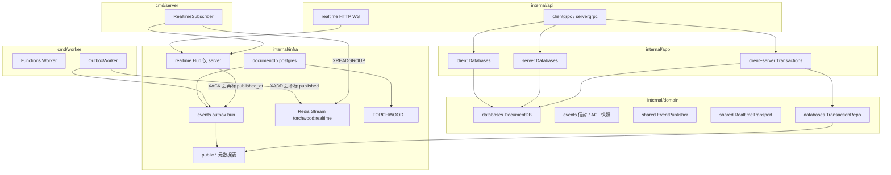
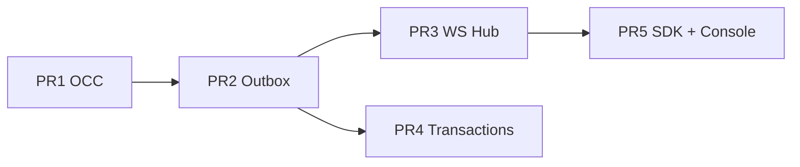

# v2 事件脊柱、轻量 Realtime 与单库事务

| 字段 | 值 |
|------|-----|
| 作者 | Torchwood Engineering（实现稿） |
| 日期 | 2026-08-15 |
| 状态 | **已批准**（设计评审 4 轮，0 open issues，2026-08-15） |
| 产品边界 | 已锁定（grill 2026-08-15）。本文不重开产品决策，只补实现细节。 |
| 关联 | `docs/roadmap.md` §3、`docs/design/v2-execution-plan.md`、`docs/prompts/implement-v2.md` |
| 过期稿 | `docs/prompts/databases-transactions.md` **禁止**作为规格 |

---

## Overview

P1 MVP 已交付用户 collection 的文档 CRUD / Increment / Bulk / Upsert，但写路径是「落库即结束」：没有 `_version`、没有可订阅的变更流、没有跨文档原子提交。内测应用要做协作编辑、计数器与多文档一致写入，必须先有 OCC、事务性 outbox，以及一条绑定项目的 WebSocket 门面。

本文把已锁定的产品决定落到现有 Clean Architecture 上：在 `internal/infra/documentdb` 为**用户集合**加整型 `_version` 并强制 OCC；在元数据库 `public.document_events_outbox` 与文档写**同一段** `BEGIN…COMMIT` 落事件；`cmd/worker` 的 OutboxWorker 把已提交行 **XADD** 到 Redis Stream，`cmd/server` 内 subscriber 写入进程内 Hub 再扇出 WebSocket；HTTP mux 增加 `GET /v1/realtime`（`http.Server` 读写超时必须关掉，见 §4.1）；再叠加单库 staged 事务 API，Commit 时按 seq 应用 ops，**同一段 CRUD 的 `Publish` 经 ctx 带上 `transaction_id`**。系统集合、API Key 挂 WS、通配频道、历史回放、2PC 均不在范围。

---

## Background & Motivation

### 当前状态

| 能力 | 现状 | 关键代码 |
|------|------|----------|
| 用户文档写 | `CreateDocument` / `UpdateDocument` / `DeleteDocument` / `UpsertDocument` / `Bulk*` 各自 `RunInTx`，改行 + `_perms` | `internal/infra/documentdb/postgres.go`：`createDocument`、`updateDocument`、`deleteDocument`、`upsertDocument` |
| Increment | 不是独立 RPC，是 `UpdateDocumentRequest.increment`（字段 6）→ `buildIncrementParts` | `proto/{client,server}/v1/databases.proto`；`postgres_permissions.go` `buildIncrementParts` |
| 乐观并发 | **无**。`UPDATE … WHERE _id = ? AND _tenant = ?`，后写覆盖 | `updateDocument` L769–777 |
| 系统列 | `_id` `_tenant` `_created_at` `_updated_at` `_created_by` `_updated_by` | `createCollectionTable` L1330–1356 |
| 系统 vs 用户集合 | `databases.IsSystemCollection` = `databaseID=="default"` 且 id ∈ `{users,sessions,identities,teams,memberships,buckets,files}`；元数据列 `document_collections.is_system` | `internal/domain/databases/system_collections.go`；migration `000009` |
| 事件 / Queue | `shared.Queue` 只服务 Functions：`torchwood:queue:functions-executions`（Redis List BRPOP） | `internal/domain/shared/ports.go`；`cmd/worker/worker.go` |
| HTTP mux | grpc-gateway + File/OAuth/Functions handler + `/console/` 前缀分流 | `internal/infra/server/grpc_gateway.go` `NewGRPCGatewayServer` |
| Document proto | `id=1 data=2 created_at=3 updated_at=4 permissions=5`，**无 version** | 两边 `databases.proto` |
| Console 保存 | `updateDocument` 只发 `data`/`increment`，删除无 query | `console/src/routes/databases/pages.tsx` L1676；`console/src/api/databases.ts` L240–264 |
| JWT access TTL | 默认 15m（`configs/config.yaml` `security.jwt.access_ttl`） | `pkg/jwtparser.Claims.ExpiresAt` |

痛点：任意并发 Update 静默丢失；无法订阅变更；无法在同一 `database_id` 下原子写多文档。v2 第一用户是自用/内测，第一门面是轻量 Realtime，高压投递日后换 MessageLoop，频道名与信封不变。

### 明确不在本文范围（产品已锁）

完整 Messaging、Agent Identity/Run、关系/向量、用户面 Webhook、Presence/频道历史、通配订阅、集群 Hub、API Key/guest 挂 WS、连接内刷新 token、系统集合事件、跨 database/project 事务、2PC/XA/Saga。

---

## Goals & Non-Goals

### Goals

1. 用户 collection 表有 `_version`；成功写 +1；Create 从 1 起。系统集合不加列。
2. 单条 Update / Delete / Increment **以及**事务内 update/delete **强制**携带匹配的 `version`；对不上或未传 → 整次调用（事务则整单）失败。
3. Bulk / Upsert / Create **不**校验 version（Bulk 保持立即执行；内部仍走现有 A4 单事务，见 §Key Decisions）。
4. 用户集合文档写（CRUD、Increment、Bulk 每篇、事务 Commit 每条 op）与 outbox `INSERT` 同 `COMMIT`。
5. `/v1/realtime` WebSocket：一连接一项目；SDK 首帧 JWT；Console cookie；按频道订阅；Client 按 `_perms` 过滤，Console platform admin 旁路。
6. Client + Server 对称事务 API：TTL 60s、最多 100 op、每 `(principal, project, database)` 1 个 pending。
7. TS/Go Client SDK 可订 Realtime；Console 集合详情有「试听」面板；**所有**一等客户端（详情保存、列表删除、CLI `update`/`delete`、SDK contract）在 OCC 上线时回传 `version`。

### Non-Goals

- 新 worker 二进制、Webhook 产品、MessageLoop 适配器（端口留好即可）。
- 事务调试 UI、文档资源式的事务 `_perms`。
- 把 Bulk 改成用户事务，或回退 A4「整批失败则回滚」的内部实现。
- 为系统集合补 `_version` 或发 `databases.documents.*` 事件。

---

## Proposed Design

### 分层总览



约束（与现码一致）：

- 端口在 domain，适配器在 infra，handler 薄（对照 `internal/api/servergrpc/databases.go`）。
- **禁止**在 gRPC handler 或 WS handler 里直接写文档或直推行（handler 只做编解码 / 握手）。
- 元数据表与租户 schema **同一 PostgreSQL 实例**（`clients.Database.RunInTx` + `Conn(ctx)` 会把 bun.Tx 放进 context）。一段 `BEGIN` 可同时写 `public.document_events_outbox` 与 `"TORCHWOOD_<internal>_<db>".<coll>`。
- `clients.InTx` / `RunInTx` 已支持嵌套复用外层事务（`internal/infra/clients/tx.go`）。Commit 与单条写都走这条路。

---

### 1. `_version` 与 OCC

#### 1.1 存储

`createCollectionTable`（`postgres.go` L1330）今天的系统列：

```sql
_id TEXT NOT NULL
_tenant BIGINT NOT NULL DEFAULT <tenant>
_created_at TIMESTAMPTZ NOT NULL DEFAULT NOW()
_updated_at TIMESTAMPTZ NOT NULL DEFAULT NOW()
_created_by TEXT
_updated_by TEXT
PRIMARY KEY (_tenant, _id)
```

**仅用户集合**追加：

```sql
_version BIGINT NOT NULL DEFAULT 1
```

判定「用户集合」与建表时 `IsSystem` 一致：

```go
isSystem := databases.IsSystemCollection(projectID, databaseID, collectionID)
```

`CreateCollection` 已把该值写入 `document_collections.is_system`（`createCollectionMetadata` L1469）。`EnsureSystemCollections` 建系统表时走同一 `CreateCollection`，因此系统表**不会**有 `_version`。

`createCollectionTable` 今日签名是 `(ctx, schema, collectionID, tenant, attrs)`，**没有** `isSystem`。实现时必须改签名，由 `CreateCollection` 传入 `databases.IsSystemCollection(projectID, databaseID, collectionID)`，**不要**在建表函数里凭 collectionID 猜。

存量用户表：不能靠静态 `db/migrations/`（表在动态 schema）。在 `postgresDocumentDB` 增加懒迁移：

```go
func (p *postgresDocumentDB) ensureVersionColumn(ctx context.Context, schema, collectionID string, isSystem bool) error
```

- `isSystem == true`：直接返回。
- 先查 `information_schema.columns`（或 `pg_attribute`）：
  - 列不存在 → `ALTER TABLE … ADD COLUMN IF NOT EXISTS _version BIGINT NOT NULL DEFAULT 1`。
  - 列已存在且 `udt_name`/`data_type` 为 `int8`/`bigint` → 视为就绪。
  - 列已存在但**不是** `bigint`（存量用户属性叫 `_version`）→ **拒绝 OCC**，返回稳定错误 `version_column_conflict`（`FailedPrecondition`），`slog.Error` 带 schema/table，**禁止**对错误类型做 `_version = _version + 1`。
- 进程内 `sync.Map` 记 `schema.collection` 已确保（含「类型合法」），避免每次写都查目录。
- **只在写路径触发**：Create / Update / Delete / Upsert / Bulk 以及事务 Commit 应用 op 之前。**Get / List / Count 禁止 ALTER**（`ADD COLUMN` 是 AccessExclusiveLock，滚动发布时读流量会堵住该集合全部会话）。
- 读路径若缺列：`scanDocumentJSON` 把 `Version` 视为 `1`，不当硬错。

存量行在成功 ALTER 后视为 `1`（`DEFAULT 1` 回填）。

#### 1.2 禁止用户属性叫 `_version`

`ValidateIdentifier`（`identifierRe = ^[a-zA-Z_][a-zA-Z0-9_]*$`）**允许** `_version`。必须在 `CreateAttribute` / `CreateCollection` 属性列表显式拒绝系统列：

```go
var reservedAttributeKeys = map[string]struct{}{
    "_id": {}, "_tenant": {}, "_created_at": {}, "_updated_at": {},
    "_created_by": {}, "_updated_by": {}, "_version": {}, "_perms": {},
}
```

错误：`InvalidArgument`，文案 `attribute key %q is reserved`。`buildInsertParts` / `buildUpdateParts` 已跳过 `_` 前缀用户字段，这是第二道防线，不能替代校验。

#### 1.3 领域模型

`internal/domain/databases/document.go`：

```go
type Document struct {
    ID          string
    Tenant      int64
    Data        map[string]any
    Permissions []Permission
    CreatedAt   time.Time
    UpdatedAt   time.Time
    CreatedBy   string
    UpdatedBy   string
    Version     int64 // 顶层；系统集合恒为 0；不进 Data
}

type DocumentUpdate struct {
    Document    Document
    Permissions []Permission
    Increment   map[string]int64
    // ExpectedVersion：用户集合且 !SkipVersion 时必填，须等于当前行。
    ExpectedVersion int64
    // SkipVersion：Bulk 内部循环、Upsert 更新支。仍执行 _version = _version + 1。
    SkipVersion bool
}

var (
    ErrVersionRequired = errors.New("version_required")
    ErrVersionMismatch = errors.New("version_mismatch")
)
```

`DeleteDocument` 增加选项结构，避免把每个假实现的形参列表拉成一长串（PR1 仍须改**全部** `DocumentDB` 实现，见 PR 清单）：

```go
type DeleteOptions struct {
    ExpectedVersion int64
    SkipVersion     bool
}

DeleteDocument(ctx, projectID, databaseID, collectionID, docID string, opts DeleteOptions, principal Principal) error
```

`BulkDeleteDocuments` 内部传 `DeleteOptions{SkipVersion: true}`。单条 Client/Server Delete 传 `ExpectedVersion` 且 `SkipVersion: false`。

`MapDocumentDBError`（`internal/app/shared/docdb_errors.go`）增加：

| 错误 | gRPC | 消息（稳定，供 SDK/Console 分支） |
|------|------|-----------------------------------|
| `ErrVersionRequired` | `FailedPrecondition` | `version_required` |
| `ErrVersionMismatch` | `FailedPrecondition` | `version_mismatch` |
| 已有非 bigint `_version` 列 | `FailedPrecondition` | `version_column_conflict` |
| 用户表尚未 ALTER、查询带 `$version` | `InvalidArgument` | `version_column_unavailable` |

HTTP 已把 `FailedPrecondition` 映射为 `ERROR_CODE_PRECONDITION_FAILED`（`proto/shared/v1/error.proto`）。不要用 `Aborted`/`ERROR_CODE_CONCURRENT_MODIFICATION`：产品指定 FailedPrecondition。

#### 1.4 Adapter OCC 算法

只对**用户集合**生效。系统集合路径（Users/Account/Teams/Storage 内部 `UpdateDocument`）**不得**要求 version，也不得 `SET _version`。

`updateDocument` 在现有权限检查之后：

```
ensureVersionColumn(...)
if user collection && !update.SkipVersion:
    if update.ExpectedVersion <= 0: return ErrVersionRequired
SET 子句追加 `_version = _version + 1`（与 _updated_at 一起）
WHERE _id = ? AND _tenant = ?  [AND _version = ?  若 OCC]
RowsAffected() == 0:
    再 SELECT _id：无行 → ErrDocumentNotFound；有行 → ErrVersionMismatch
```

权限-only 更新（今日 L759–767 只刷审计列）同样 `+1` 并要求 version。

Increment 走同一函数，`buildIncrementParts` 不变；**必须**带 version。

`deleteDocument`：

```
若用户集合 && !skipVersion:
    先 SELECT _version, … FOR UPDATE
    ExpectedVersion<=0 → ErrVersionRequired
    不等于 → ErrVersionMismatch
清 _perms + DELETE
```

（PR2 会在 DELETE 前把写前 ACL + 删除前 version 放进 outbox。）

Create：依赖列 DEFAULT 1，不必在 INSERT 列表写 `_version`。`scanDocumentJSON` 增加：

```go
if v, ok := payload["_version"].(float64); ok {
    doc.Version = int64(v)
}
```

JSONB `to_jsonb(d.*)` 的数字是 float64，与现有 `_tenant` 解析一致。

Upsert：

- 插入支：DEFAULT 1。
- 更新支：`SET _version = _version + 1`，**不**加 `AND _version = ?`（盲写）。
- `SkipVersion` 语义内建在 upsert 更新支，不必走 `DocumentUpdate`。

Bulk：`bulkUpdateDocuments` / `bulkDeleteDocuments` 设 `SkipVersion: true`。这是**唯一**允许跳过 OCC 的 Update/Delete 调用方（事务 Commit 不跳过）。

> 注意：现有 Bulk 已包在单个 `RunInTx` 里（`TestBulkUpdateDocuments_RollbackOnFailure`，A4）。产品说的「非原子」是指 **Bulk 不是用户事务 API**（无 `transaction_id`、无 OCC、不与 Transactions 混用）。**不要**回退 A4。

#### 1.5 查询 DSL

`mapQueryField` / `systemQueryFields`（`postgres.go` L1754–1767）增加：

```go
case "$version", "_version":
    return "_version"
```

`systemQueryFields` 加入 `"_version"`。`validateQueryFields`：

- 若 `coll.IsSystem` 且字段为 `_version` → `InvalidArgument`（系统表无此列）。
- 若用户集合且 `_version` 列**尚未确保**（写路径还没 `ALTER`；读路径禁止 DDL）：**禁止**把 `$version`/`_version` 编进 SQL。`validateQueryFields`（在 `buildAppwriteQuery` 之前，`postgres.go` L877 / L1059）返回 `InvalidArgument`，稳定文案 `version_column_unavailable`。不要落到 PG `42703`。不要改写成对常量 `1` 的比较（`equal("$version", 2)` 会静默语义错误）。
- 列是否存在：复用写路径的 `sync.Map`；读路径 cache miss 时只查 `information_schema.columns` / `pg_attribute`，**不** `ALTER`。列已是 bigint 则把 key 记入 cache，允许后续 `$version` 查询。

#### 1.6 谁强制 version（use-case）

| 路径 | version |
|------|---------|
| Client/Server `UpdateDocument`（含仅 increment / 仅 permissions） | 必填；`HasVersion()` 为 false 或 `<=0` → `version_required` |
| Client/Server `DeleteDocument` | 必填 |
| `CreateDocument` / `UpsertDocument` / `Bulk*` | 不读 version 字段 |
| 系统集合写（Users 等内部） | 不经过 Databases use-case 的强制；adapter 见 `isSystem` 跳过 |
| 事务内 update/delete | 必填，见 §5。Commit 时的权限检查与单条 CRUD **完全一致**（update 只查 update，delete 只查 delete；**不**另加产品旧稿的 read+update） |

Client `UpdateDocument`（`internal/app/client/databases.go` L185）与 Server（`internal/app/server/databases.go` L403）签名增加 `version int64, versionSet bool`（或直接收 `*int64`）。handler 用 proto3 `optional` 的 presence。

---

### 2. 事件目录与信封

#### 2.1 只从用户集合文档写产生

| `event` | 触发 | `data` | 投递过滤基准 |
|---------|------|--------|----------------|
| `databases.documents.create` | Create；Upsert 插入支；事务 create / upsert 插入 | 写后全文档 | **写后**能 read |
| `databases.documents.update` | Update；Increment；Upsert 更新支；BulkUpdate 每篇；事务对应 op | 写后全文档 | **写前**能 read |
| `databases.documents.delete` | Delete；BulkDelete 每篇；事务 delete | 省略（仅 id + 删除前 version） | **写前**能 read |

失败写、Rollback、过期事务、空 Commit、系统集合写：**不**发事件。

Increment **不**单独列事件名。

#### 2.2 信封（outbox 内存完整；WS 出站必须剥掉 `acl`）

```json
{
  "event_id": "01J...",
  "event": "databases.documents.update",
  "project_id": "default",
  "database_id": "app",
  "collection_id": "posts",
  "document_id": "p1",
  "version": 4,
  "transaction_id": "",
  "created_at": "2026-08-15T12:00:00Z",
  "truncated": false,
  "data": {
    "id": "p1",
    "data": { "title": "..." },
    "permissions": ["read:user:u1", "update:user:u1"],
    "created_at": "2026-08-15T11:00:00Z",
    "updated_at": "2026-08-15T12:00:00Z",
    "version": 4
  },
  "acl": {
    "document_security": true,
    "collection_permissions": ["read:any", "create:users"],
    "document_permissions": ["read:user:u1"],
    "doc_has_perms": true
  }
}
```

规则：

- `event_id`：`pkg/idgen.ULID()`，outbox PK，客户端去重。
- `data` 与 REST `Document` 同形（`mapDocument` / `mapClientDocument` 输出），含顶层 `version`，不含 `_` 系统列。
- delete：无 `data`，`version` = 删除前版本。
- `transaction_id`：仅事务 Commit 的事件非空；Bulk **永不**带。
- `acl`：仅服务端投递过滤快照，**写入 outbox.payload，不得下发出站 WS**。create 用**写后** `_perms` + 当时 collection ACL；update/delete 用**写前**。集合 ACL 事后变更不影响已发出事件的可见性。集合频道订阅**不要求** collection 级 read，若把 `acl` 原样推给客户端会泄漏完整集合/写前文档 ACL。
- `data.permissions` 与 REST Get 同形，**可以**留在出站帧。
- `truncated`：见载荷上限。

出站帧必须走 `Envelope.ClientPayload()`（或 `Public()`）：去掉 `acl`，保留 `event_id` / `event` / 资源 id / `version` / `transaction_id` / `created_at` / `truncated` / `data`。Hub 只用内存里的 `ACL` 做 `VisibleTo`。测试：非 admin 客户端帧不得出现 `acl` 或 `collection_permissions`。

领域类型放 `internal/domain/events`：

```go
const (
    EventDocumentsCreate = "databases.documents.create"
    EventDocumentsUpdate = "databases.documents.update"
    EventDocumentsDelete = "databases.documents.delete"
)

type ACLSnapshot struct {
    DocumentSecurity      bool
    CollectionPermissions []databases.Permission
    DocumentPermissions   []databases.Permission
    DocHasPerms           bool
}

type Envelope struct {
    EventID        string
    Event          string
    ProjectID      string
    DatabaseID     string
    CollectionID   string
    DocumentID     string
    Version        int64
    TransactionID  string
    CreatedAt      time.Time
    Truncated      bool
    Data           *databases.Document // delete 时 nil
    ACL            ACLSnapshot
}

func (e Envelope) CollectionChannel() string { /* databases.{db}.collections.{coll} */ }
func (e Envelope) DocumentChannel() string   { /* ...documents.{id} */ }

// ClientPayload 出站 JSON：不含 acl。
func (e Envelope) ClientPayload() map[string]any

// VisibleTo 复用 AllowsDocumentAccess(..., "read", roles)。
func VisibleTo(acl ACLSnapshot, p databases.Principal) bool
```

`VisibleTo`：`p.IsSystem()` 或 `p.PlatformAdmin` → true；否则：

```go
coll := &databases.Collection{
    DocumentSecurity: acl.DocumentSecurity,
    Permissions:      acl.CollectionPermissions,
    IsSystem:         false, // 用户集合事件
}
return databases.AllowsDocumentAccess(coll, acl.DocumentPermissions, acl.DocHasPerms, "read", p.Roles)
```

#### 2.3 载荷上限

**上限：256 KiB**（UTF-8 JSON 序列化后的整个 envelope）。

超出时：

1. **文档写仍然成功**（不因事件过大回滚业务写）。
2. 去掉 `data`，设 `truncated=true`，保留 id / version / event / acl / 频道字段。
3. 再序列化；acl+元数据仍超 256KiB（极端权限列表）则 acl 的 permission 数组截断并记日志，`truncated=true`。内测文档通常 < 64KB，256KiB 留余量。

客户端见 `truncated=true` 应 `GetDocument`。

#### 2.4 频道

```
databases.{databaseId}.collections.{collectionId}
databases.{databaseId}.collections.{collectionId}.documents.{documentId}
```

无通配。一条事件投入**两个**频道；连接只收到已订阅的那一侧。

解析：`databaseId`/`collectionId` 满足 `identifierRe`（不含 `.`）。`documentId` 满足 `docIDRe`（**可以含 `.` `:` `-`**）。解析必须用字面量分段，不能 `strings.Split(channel, ".")`：

```
databases . <db> . collections . <coll> [ . documents . <doc...> ]
```

`<doc...>` 取余下全部。

---

### 3. Transactional Outbox

#### 3.1 表（元数据库 `public`，bun + golang-migrate）

新文件 `db/migrations/000011_document_events_outbox.up.sql`：

```sql
CREATE TABLE document_events_outbox (
    event_id        TEXT PRIMARY KEY,
    project_id      TEXT NOT NULL,
    topic           TEXT NOT NULL,
    payload         JSONB NOT NULL,
    created_at      TIMESTAMPTZ NOT NULL DEFAULT NOW(),
    available_at    TIMESTAMPTZ NOT NULL DEFAULT NOW(),
    attempts        INT NOT NULL DEFAULT 0,
    dispatched_at   TIMESTAMPTZ,
    published_at    TIMESTAMPTZ
);

CREATE INDEX document_events_outbox_poll
    ON document_events_outbox (available_at)
    WHERE published_at IS NULL;

CREATE TABLE document_events_outbox_dead (
    event_id     TEXT PRIMARY KEY,
    project_id   TEXT NOT NULL,
    topic        TEXT NOT NULL,
    payload      JSONB NOT NULL,
    attempts     INT NOT NULL,
    last_error   TEXT,
    failed_at    TIMESTAMPTZ NOT NULL DEFAULT NOW(),
    created_at   TIMESTAMPTZ NOT NULL
);
```

`topic` 存集合频道名（fan-out 时 Hub 再投文档频道）。也可存 JSON 数组 `["coll","doc"]`；实现选前者，Hub 根据 envelope 推两个频道、连接侧过滤。

**不要**把 outbox 建在租户 schema。

#### 3.2 端口

`internal/domain/shared/ports.go` 在现有 `Queue` 旁追加：

```go
type EventPublisher interface {
    // Publish 必须能感知 ctx 中的 bun.Tx（clients.Conn）。
    // 写路径在同一事务内调用；未在事务中则自行短事务插入。
    // 若 ctx 带 events.TransactionID，写入信封 transaction_id；否则留空。
    Publish(ctx context.Context, ev events.Envelope) error
}

// RealtimeTransport 是 outbox → server Hub 的最后一跳（至少一次）。
// P2 实现：Redis Streams + consumer group。日后可换 MessageLoop，频道与信封不变。
type RealtimeTransport interface {
    Enqueue(ctx context.Context, ev events.Envelope) error // worker: XADD
}

// RealtimeFanout 仅存在于 cmd/server 进程：从 transport 拉消息并写入 Hub。
type RealtimeFanout interface {
    Run(ctx context.Context) error
}
```

- `EventPublisher`：落 outbox。实现：`internal/infra/events/outbox.go`，必须用**同一个** `*clients.Database` 的 `Conn(ctx)`。
- `RealtimeTransport`：worker 只负责 `XADD`，**不**持有 WebSocket。
- Hub 只活在 `cmd/server`。

`NopEventPublisher` 供 PR1 测试与未接线时使用。

`transaction_id` 传递（锁定，**禁止** Commit 后再单独 INSERT outbox）：

```go
// internal/domain/events/context.go
func WithTransactionID(ctx context.Context, id string) context.Context
func TransactionIDFrom(ctx context.Context) string // 无则 ""
```

`EventPublisher.Publish` 在序列化前：`if id := events.TransactionIDFrom(ctx); id != "" { ev.TransactionID = id }`。Commit 的 `RunInTx` **先** `ctx = events.WithTransactionID(ctx, tx.ID)` 再调现有 CRUD。Bulk / 单条 CRUD **不**注入该键。`DocumentDB` 写方法签名不增加 `transaction_id`。

#### 3.3 写路径挂钩（同一 Tx）

`NewPostgresDocumentDB` 增加依赖：

```go
func NewPostgresDocumentDB(db *clients.Database, pub shared.EventPublisher) databases.DocumentDB
```

`pub == nil` 视为 nop（单测）。`documentdb.ProviderSet` + `task wire-all`。

在 `createDocument` / `updateDocument` / `deleteDocument` / `upsertDocument` **成功读回之后、函数返回之前**（仍在 `RunInTx` 内）调用 `Publish`：

```
create / upsert-insert → EventDocumentsCreate，acl=写后
update / increment / upsert-update → EventDocumentsUpdate，acl=写前（须在 SET 之前 snapshot）
delete → EventDocumentsDelete，acl=写前，version=删除前
```

写前 snapshot：`getDocumentPermissions` + `GetCollection`（update 路径已有 coll）。update 在改 `_perms` 前抓拍。

系统集合：`IsSystemCollection` 或 `coll.IsSystem` → 不 Publish。

Bulk：每篇成功的 Update/Delete 各 Publish 一次；因在同一外层 Tx，失败则文档与 outbox 一起回滚。ctx **不**带 `TransactionID`。

**不要**在 `internal/app/*/databases.go` 成功返回后再 Publish——会丢「写已提交、事件未写」窗口。事务 Commit 也**不要**再插一遍 outbox。

#### 3.4 OutboxWorker 与最后一跳（Redis Streams）

`task dev-server` / `task worker` 是**两个进程**。进程内 Hub 只活在 server，worker 直调 Hub 会静默丢事件。Redis Pub/Sub 无 ack：先 `PUBLISH` 再标 `published_at`，server 未订/空窗/`PUBLISH` 返回 0 时消息已丢但 outbox 已标发布——与否决 Redis-first 是同一失败模式。

**锁定运输（至少一次）**：Redis Streams + consumer group，**不是** Pub/Sub。

| 进程 | 职责 |
|------|------|
| `cmd/worker` `OutboxWorker` | 领取 outbox → `XADD MAXLEN ~` → 只标 `dispatched_at`，**不**标 `published_at` |
| `cmd/server` `RealtimeSubscriber` | `XGROUP CREATE MKSTREAM`（`BUSYGROUP` 忽略）；**每轮先认领 PEL 再读新消息**；Hub 扇出；成功后 `XACK` **再** `published_at` |

`XREADGROUP … STREAMS key >` **只返回从未投给本组的新消息**，不会把本 consumer 的 PEL 再吐出来。go-redis v9（仓库已有 `*redis.Client`）的 `XReadGroupArgs.Claim` / `XAutoClaim` 才是 PEL 主路径。落地人若按字面只写 `>`，「不 XACK，下次再投」会变成**永远不再投**；领取 SQL 若只选 `dispatched_at IS NULL`，2min 回收也跑不到。

**Subscriber 循环（锁定，PEL 是主路径）**：

```
group = "torchwood-realtime"
consumer = hostname + ":" + pid   // 进程内唯一

Start:
  // 0-0：建组前已 XADD 的条目仍作为本组新消息被 > 读出。
  // 禁止用 $（只消费建组之后的新消息）。worker 先于 server 启动时
  // $ 会让首批事件既不进 >、也不在 PEL，只能等 2min 兜底。
  // server 与 worker 启动无顺序要求。
  XGROUP CREATE torchwood:realtime group 0-0 MKSTREAM
  if BUSYGROUP: ignore   // 组已存在，之后不受 ID 影响
  // 启动先排空 PEL（从 0-0 循环 XAUTOCLAIM 直到空）

Loop:
  1. XAUTOCLAIM key group consumer MINIDLE 30s START 0-0 COUNT 32
     // 或同一次 XREADGROUP 带 XReadGroupArgs.Claim（idle=30s）
  2. XREADGROUP GROUP group consumer BLOCK 200ms COUNT 32 STREAMS key >
  3. 每条消息：解码 **完整** envelope（与 outbox.payload 同形，**必须含 acl**）
     Hub.Dispatch(ev)          // 完整信封；VisibleTo 用 ev.ACL
     成功 → XACK + UPDATE outbox SET published_at = NOW() WHERE event_id = ?
     扇出前失败 → 不 XACK（留 PEL）；30s idle 后本循环步骤 1 认领
     // 禁止 Hub.Dispatch(ClientPayload())：剥掉 acl 后
     // DocumentSecurity=false、权限为空 → 非 admin 永远收不到事件
  4. Redis 断线：指数退避重订，不得退出进程
```

**必测**：读出后、XACK 前杀掉 subscriber，重启后在 **远小于 2min**（约 30s idle）内再投同一 `event_id`。Hub / 客户端按 `event_id` 去重。

领取 SQL（**新消息 + 整进程挂死兜底写在同一块**，间隔 200ms）：

```sql
-- 主路径：尚未进 Stream
SELECT event_id, payload
  FROM document_events_outbox
 WHERE published_at IS NULL
   AND available_at <= NOW()
   AND dispatched_at IS NULL
 ORDER BY available_at
 LIMIT 32
 FOR UPDATE SKIP LOCKED;

-- 兜底（不是主路径）：整个 server 挂死、无人 Claim PEL
-- 与上面同一轮、同一 FOR UPDATE SKIP LOCKED 语义，可用 OR 合并
SELECT event_id, payload
  FROM document_events_outbox
 WHERE published_at IS NULL
   AND dispatched_at IS NOT NULL
   AND dispatched_at < NOW() - INTERVAL '2 minutes'
 ORDER BY dispatched_at
 LIMIT 32
 FOR UPDATE SKIP LOCKED;

-- XADD 成功：dispatched_at = NOW()（回收分支同样刷新）
-- XADD 失败：attempts+1，available_at 指数退避；attempts>=10 → dead
```

回收再 `XADD` 允许 Stream 里出现重复 `event_id`；Hub 与客户端去重。旧 PEL 条目在 subscriber 复活后由 `XAUTOCLAIM` 认领并 `XACK`，避免 PEL 泄漏。2min SQL 只覆盖「server 进程没人跑 Claim」的情况。

`XADD` **必须**带近似裁剪，否则 Stream 随每次文档写无限涨（outbox 有 7 天清理，Stream 默认没有）：

```
XADD torchwood:realtime MAXLEN ~ 50000 *
  payload <outbox.payload 完整 JSON，必须含 acl>
```

字段锁定为 **一整份与 `document_events_outbox.payload` 同形的 envelope JSON**（含 `acl`）。禁止只 XADD `ClientPayload()`。`~` 近似裁剪，避免同步卡顿。内测 50k 条约几十 MB。ACK 后不必再 `XTRIM`；回收重放靠 `event_id` 去重。

Hub 内部分工（与 §4.5 一致，这里再写死一次）：

- `Hub.Dispatch(ev Envelope)` 收**完整**信封，用 `ev.ACL` 做 `VisibleTo`。
- **仅**往连接有界 chan 里放 `ev.ClientPayload()`（无 `acl`）。

其它行为：

- 无 WebSocket 订阅者：仍 `XACK` + 标 `published_at`（合法事件、此刻无人听；重连不补历史）。
- `Stop`：取消 ctx，处理完当前条再退。
- Functions `Worker.consume` 不动。P1 B2 已在 `requeue` 落地。不新 worker 二进制。

内测量级：数十连接、payload < 64KB、32 行/批、200ms 一轮足够。已发布 outbox 行 7 天后可删。

---

### 4. 轻量 Realtime

#### 4.1 挂载点与 `http.Server` 超时（锁定）

lynx v1.3.0 的 `lynxhttp.WithTimeout` 设置的是 **`http.Server` 的 `ReadHeaderTimeout` / `ReadTimeout` / `WriteTimeout`**（`github.com/lynx-go/lynx@v1.3.0/server/http/server.go`），**不是** handler 级 `http.TimeoutHandler`。`NewGRPCGatewayServer`（`grpc_gateway.go` L99–101）把整个 combined mux 交给同一个 60s timeout 的 `http.Server`。仅按路径把 `/v1/realtime` 分到另一个 handler **换不掉 listener 超时**：Go 在 serve 时把 deadline 打到 `net.Conn`；Hijack/Upgrade 之后 deadline 仍在。JWT access 默认 15m，连接会在约 60s 被杀。ping **不能**重置 `http.Server` 一次性 Read/Write deadline。

**锁定实现（两件事都做）**：

1. **关掉该 `http.Server` 的读写超时，但保留握手超时**。lynx `WithTimeout` 会**同时**写 `ReadHeaderTimeout` / `ReadTimeout` / `WriteTimeout`。只传 `WithTimeout(0)` 会清掉慢握手/Slowloris 上限，与「保留 10s 读头」矛盾。`WithServerOptions` 在内部赋值**之后**执行，可以单独改三个字段。

**锁定**（不要写「`WithTimeout(0)` 或 `WithServerOptions`」二选一）：

```go
// WithTimeout(0) 只作前置，清掉 lynx 默认 60s，且必须被下面的 ServerOptions 覆盖。
lynxhttp.WithTimeout(0),
lynxhttp.WithServerOptions(func(s *http.Server) {
    s.ReadTimeout = 0
    s.WriteTimeout = 0
    s.ReadHeaderTimeout = 10 * time.Second
}),
```

非 WS 路径自己套 60s `http.TimeoutHandler`：

```go
var routed http.Handler = http.HandlerFunc(func(w http.ResponseWriter, r *http.Request) {
    switch {
    case r.URL.Path == "/v1/realtime":
        realtime.ServeHTTP(w, r) // 不套 TimeoutHandler
        return
    case strings.HasPrefix(r.URL.Path, "/console/") || r.URL.Path == "/console":
        http.TimeoutHandler(consoleHandler, 60*time.Second, "timeout").ServeHTTP(w, r)
        return
    default:
        http.TimeoutHandler(mux, 60*time.Second, "timeout").ServeHTTP(w, r)
    }
})
```

2. **`websocket.Accept` 之后立刻清 conn deadline**，再用 ping 滑窗：

```go
conn, _ := websocket.Accept(...)
if hj, ok := w.(http.Hijacker); ok { /* Accept 已 hijack */ }
// coder/websocket：NetConn 或底层
nc := websocket.NetConn(ctx, conn, websocket.MessageText)
_ = nc.SetReadDeadline(time.Time{})
_ = nc.SetWriteDeadline(time.Time{})
// 每条 Read/Write 前设短 deadline（如 60s），收到帧 / 写完即清；
// 服务端 30s ping，2 个间隔无 pong 则关。
```

**必测**：集成测试保持连接 **> 60s**，只靠 ping 续命，不断开。

不要用 `runtime.ServeMux.HandlePath`。依赖：`github.com/coder/websocket`。

CORS：现有 `CORSMiddleware` 包在最外。须允许 `GET` + `Upgrade`。

#### 4.2 握手

文本 JSON 帧。一连接绑定一个 `project_id`，此后不可换。

客户端 → 服务端首帧：

```json
{ "type": "hello", "project_id": "default", "access_token": "<jwt 可选>" }
```

| 调用方 | 身份 |
|--------|------|
| TS/Go Client SDK | **必须** `access_token`（Client JWT access，`ttp=access`）。`Authorization` 不作浏览器主路径。 |
| Console 试听 | same-origin cookie `TORCHWOOD_session_console`；可省略 `access_token`。仍须带当前控制台 `project_id`。 |

拒绝：

- API Key（`X-Api-Key` 或 `CredentialTypeAPIKey`）
- guest / 未认证
- 非法、过期、`ttp != access`
- `project_id` 空
- Client JWT：`project_id` 与 claims `pid` 不一致
- 多凭证：`access_token` 与 `X-Api-Key` 并存；或 `access_token` 与 session cookie 并存且将导致身份歧义 → 关连接（对齐 `serverhttp/auth.go`）

**Console / Admin 绑定项目（必须按此顺序）**：

`principalFromJWT` 对 admin **不填** `ProjectID`（`internal/infra/auth/validator.go` L150–159）。`ValidateAdminProjectAccess` 在 `ProjectID == ""` 时直接成功（L300–302）。因此：

1. cookie / admin token 校验通过后，**先** `principal.ProjectID = hello.project_id`（空则关连接）。
2. **再** `ValidateAdminProjectAccess`。未绑定项目的 admin **禁止**连上。
3. 非 platform admin（`member`/`viewer`）若 `HasProjectAccess` 失败 → 关连接。

试听入口仅对 **`owner`/`admin`（`isPlatformAdmin`）** 显示。`member`/`viewer` 不展示 tab（避免旁路只给 platform admin、member 订了却因 `Roles=["member"]` 永远收不到文档事件）。

校验复用 `Validator.ValidateToken` / `ValidateCredential(..., CredentialTypeSession)`，**不要**重写 JWT 解析。

成功：

```json
{ "type": "hello_ok", "connection_id": "<ULID>" }
```

记下 `claims.ExpiresAt`。到期服务端关连接（`websocket.StatusPolicyViolation` + 原因 `token_expired`）。**无**连接内 refresh。

- **SDK**：现有 `/v1/account/refresh` 后再 hello + 重订。不补历史。
- **Console 试听**：断线后走现有 `/v1/console/auth` refresh（cookie），再 hello + 重订当前集合频道。失败则 UI 显示「已断开，点击重连」。

默认 access TTL 15m，连接寿命 ≤ 该值。version 跳号由客户端 `GetDocument`。

#### 4.3 订阅协议

```json
{ "type": "subscribe",   "id": "c1", "channel": "databases.app.collections.posts" }
{ "type": "unsubscribe", "id": "c1", "channel": "..." }
{ "type": "subscribed",  "id": "c1", "channel": "..." }
{ "type": "error",       "id": "c1", "code": "NOT_FOUND", "message": "..." }
{ "type": "event",       "channel": "...", "payload": { /* Envelope.ClientPayload()，无 acl */ } }
{ "type": "ping" }
{ "type": "pong" }
```

服务端每 30s 发 `ping`；2 个间隔未收到 `pong` 则断开。客户端也可发 `ping`。

| 频道 | 订的条件 | 失败码 |
|------|----------|--------|
| 集合 | `GetCollection` 存在、`!IsSystem`、`!Disabled`。**不**查 collection 级 read | 一律 `NOT_FOUND`（系统 / 停用 / 不存在同一码，防枚举） |
| 文档 | 文档存在 **且** 当前 principal 能 `read`（`GetDocument`） | 一律 `NOT_FOUND` |

停用集合：Console admin 在 REST 上可写停用集合（`ensureCollection` 对 PlatformAdmin 放行），但 **Realtime 订阅仍拒绝停用集合**（产品：No disabled collections）。

#### 4.4 配额

| 项 | 值 | 超限 |
|----|-----|------|
| 每用户连接 | 4 | 拒绝新连，关 socket，`error` 码 `RESOURCE_EXHAUSTED`（握手失败可在升级后立刻发一帧再关，或握手前若能识别用户则关） |
| 每连接订阅 | 32 | `error` 码 `RESOURCE_EXHAUSTED`，连接保持 |

配额键：

- Client JWT：`user:{UserID}`
- Console admin：`admin:{ActorID}`

常量放 `internal/infra/realtime/quotas.go`（P2 不改 `config.proto`，避免无关的 `generate-config`）。

#### 4.5 Hub 与过滤

路径：**OutboxWorker → `RealtimeTransport`（Redis Stream）→ `cmd/server` `RealtimeSubscriber` → Hub → 连接**。进程内 worker 直连 Hub 仅当强制单进程（本仓库默认双进程，**不要**当默认实现）。

`internal/infra/realtime/hub.go`：单实例 `map[channel]map[connID]*Conn`，`sync.RWMutex`。只存在于 server 进程。

Subscriber 把 Stream/`outbox.payload` 解成**完整** `Envelope`（含 `acl`），再调 `Hub.Dispatch(ev)`。`Dispatch` **不得**只收 `ClientPayload` map。

```
// ev 必须带 ACL
func (h *Hub) Dispatch(ev events.Envelope)
for ch in [collectionChannel, documentChannel]:
  for conn in hub.Subscribers(ch):
    if conn.PlatformAdmin || events.VisibleTo(ev.ACL, conn.DocPrincipal):
      enqueue ev.ClientPayload() 帧  // 仅此处剥 acl
      （每连接有界 chan，满则丢该事件并 metric+log，不阻塞 subscriber）
```

**出站 JSON 不得含 `acl`。** 测试：非 admin 按写前/写后 `_perms` 能收到事件；帧内无 `acl` / `collection_permissions`。

Client JWT：`databases.Principal{Roles: jwt.Roles}`（含 `user:` / `team:` / `users`）。  
Console platform admin：`PlatformAdmin: true`，旁路 `_perms`，集合频道收该集合全部事件。

包缓冲建议 64 帧；慢客户端落后则丢事件（重连不补历史）。

#### 4.6 鉴权与分层

| 层 | 包 |
|----|-----|
| WS 握手 / 帧 / 配额 / 到期断开 | `internal/api/realtime` |
| Hub | `internal/infra/realtime` |
| Stream 运输 | `internal/infra/events` 或 `internal/infra/realtime/stream.go` |
| Subscriber | `cmd/server` lynx.Service |
| 订阅校验 | 调 `databases.DocumentDB` |
| Wire | `NewHub`、`NewRealtimeHandler`、`NewRealtimeSubscriber`；`NewGRPCGatewayServer` 增加 handler；**`WithTimeout(0)` + `WithServerOptions`(Read/Write=0, ReadHeader=10s)** |

`internal/api/provides.go` 注册 `realtime.NewHandler`。

---

### 5. 单库事务

#### 5.1 元数据表（`db/migrations/000012_document_transactions.up.sql`）

```sql
CREATE TABLE document_transactions (
    id           TEXT PRIMARY KEY,
    project_id   TEXT NOT NULL REFERENCES projects(id),
    database_id  TEXT NOT NULL,
    status       TEXT NOT NULL,
    created_by   TEXT NOT NULL,
    expire_at    TIMESTAMPTZ NOT NULL,
    created_at   TIMESTAMPTZ NOT NULL DEFAULT NOW(),
    updated_at   TIMESTAMPTZ NOT NULL DEFAULT NOW()
);

CREATE UNIQUE INDEX document_transactions_one_pending
    ON document_transactions (created_by, project_id, database_id)
    WHERE status = 'pending';

CREATE TABLE document_transaction_ops (
    id              TEXT PRIMARY KEY,
    transaction_id  TEXT NOT NULL REFERENCES document_transactions(id) ON DELETE CASCADE,
    seq             INT NOT NULL,
    op_type         TEXT NOT NULL,
    collection_id   TEXT NOT NULL,
    document_id     TEXT NOT NULL,
    data            JSONB,
    permissions     TEXT[],
    increment       JSONB,
    version         BIGINT,
    created_at      TIMESTAMPTZ NOT NULL DEFAULT NOW(),
    UNIQUE (transaction_id, seq)
);
```

`status`：`pending` | `committed` | `rolled_back` | `expired`。

`created_by`：

| 主体 | 值 |
|------|-----|
| Client JWT | `user:{UserID}` |
| API Key | `key:{APIKeyID}` |
| Console admin | `admin:{ActorID}` |

部分唯一索引保证「同一 created_by + project + database 仅 1 个 pending」，竞态第二次 Create 得 `23505` → `FailedPrecondition`（`transaction_already_pending`）。

TTL **60s 不可续**。`expire_at = now+60s`。Commit 见 `now >= expire_at` → 标 `expired`，`FailedPrecondition`（`transaction_expired`）。Worker cleaner 可扫过期 pending 标 `expired`；终态行 24h 后删。

#### 5.2 操作者

| 主体 | Create | 追加 / Commit / Rollback |
|------|--------|---------------------------|
| 创建者 | 自己的 | 自己的 pending |
| Console platform admin | 可以 | **任意** pending |
| API Key 且 scope 含 `databases.write` 或裸 `databases` 或 `*` | 可以 | **任意** pending |
| 其他终端用户 | — | `PermissionDenied` |

事务**不是**带 `_perms` 的文档。判断 API Key 写权限复用 `interceptor.APIKeyScopeAllowed` 同一套（`pkg/grpc/interceptor/apikey_scope.go`）。

系统集合、`is_system=true`、错误 `database_id`（与路径不一致）、跨 database：`InvalidArgument` 或 `FailedPrecondition`（`system_collection_not_allowed`）。追加阶段校验失败 **不**改 status。

#### 5.2.1 追加必须锁行（与 Commit 同一行锁）

`AppendOp` **禁止**裸 INSERT。追加 / 分配 `seq` / 检查 100 上限都必须：

```
BEGIN
  SELECT … FROM document_transactions WHERE id=? FOR UPDATE
  非 pending → transaction_not_pending（含已 committed / rolled_back / expired）
  过期 → SET expired；transaction_expired
  COUNT(ops) >= 100 → transaction_ops_limit
  seq = COALESCE(MAX(seq),0)+1   -- 在锁内，禁止 COUNT(*)+1 无锁
  INSERT op
COMMIT
```

`TransactionRepository.AppendOp` 自己不锁的话，use-case 必须先 `LockPending` 再插。未锁行时，Commit 的 `ListOps` 之后、`status=committed` 之前插入的 op 会变成未 apply、无 outbox 的孤儿行。

#### 5.3 提交语义

```mermaid
sequenceDiagram
  participant C as Client
  participant UC as Transactions use-case
  participant TX as document_transactions
  participant DOC as user collection table
  participant OB as document_events_outbox

  C->>UC: CommitTransaction
  UC->>TX: BEGIN applyTx; lock row FOR UPDATE
  alt expired
    UC->>TX: SET expired; COMMIT applyTx
    UC-->>C: FailedPrecondition transaction_expired
  else not pending
    UC->>TX: ROLLBACK
    UC-->>C: FailedPrecondition transaction_not_pending
  else empty ops
    UC->>TX: status=committed
    UC->>TX: COMMIT
    UC-->>C: Transaction (committed)
  else apply ops
    Note over UC: ctx = WithTransactionID
    loop seq order
      UC->>DOC: create/update/delete/upsert + OCC
      Note over DOC: Publish 读 ctx 写入 transaction_id
    end
    UC->>TX: status=committed
    UC->>TX: COMMIT applyTx
    UC-->>C: Transaction
  end
  alt applyTx 因 version/perm 失败
    Note over UC: bun 回滚整段，status 仍是 pending
    UC->>TX: 另开短事务：若仍 pending 则 SET rolled_back
    UC-->>C: FailedPrecondition
  end
```

实现：`clients.Database.RunInTx` 作为 **applyTx**。锁 `document_transactions` 行。按 `seq` 调现有 CRUD（ctx 已 InTx）。**不要**在循环后再单独 INSERT outbox。

权限与单条 CRUD **完全一致**（现网 D3：`updateDocument` 只查 update，`deleteDocument` 只查 delete）。产品旧稿「事务 update 校验 read+update」**不执行**——调用方本就要先 Get 才拿得到 version。

同文档多 op：**允许**。内存 `map[coll/doc]int64` 跟踪本 Tx 内版本：

- create 成功 → 记 `1`
- upsert-insert 成功 → 记 `1`（后一条 update 必须传 `1`）
- update / upsert-update 成功 → `prev+1`（`prev` 先查本 Tx map，否则读行上当前 `_version`）
- 外部读者在 COMMIT 前不可见
- 外部在 pending 期间改了同一行：applyTx OCC 失败 → **整段 ROLLBACK**（含任何误写的 status）

**`rolled_back` 必须另开短事务**（锁定）：`DB.RunInTx` 失败会回滚 applyTx 内对 `document_transactions` 的一切更新。若把 `SetStatus(rolled_back)` 放在同一段里，行会回到 `pending`，二次 Commit 会再试，打穿「不可重试同 id」。

```
applyErr := db.RunInTx(apply)  // 成功路径里 SET committed
if applyErr != nil && isVersionOrPerm(applyErr) {
    _ = db.RunInTx(func(ctx) {
        LockPending; if still pending { SET rolled_back }
    })
}
```

过期：在锁行后**就地** `SET expired` 并 `COMMIT`，**不** apply ops（这一段可以成功提交）。

二次 Commit：非 pending → `transaction_not_pending`。测试：失败后 `GetTransaction` 为 `rolled_back`，再 Commit → `transaction_not_pending`。

空事务 Commit：成功，无事件。

Increment 不是独立 `op_type`：挂在 `update` 的 `increment` JSONB 上，与 REST 一致。

#### 5.4 与普通写的互斥

pending 期间**不**锁用户行。互斥全靠 `_version`：外部 Update 先 +1，Commit 对不上则整单失败，外部写入保留。

---

## API / Interface Changes

### Proto 规则回顾

- 新字段只用空号；删除用 `reserved`，禁止复用。
- 更新类 presence 用 `proto3 optional`。
- 时间用 `google.protobuf.Timestamp`。
- 新 RPC 必须能被 `collectMethodsByAccess` 看到：Client 服务默认 `ACCESS_AUTHENTICATED`，Server 默认 `ACCESS_API_KEY`，新方法可继承，不必逐条写 `method_auth`（与现有 Document RPC 一致）。
- 改完 `task generate-proto`；禁止手改 `genproto/`。
- `internal/infra/server/grpc_swagger_test.go` 会校验 swagger 扩展与 `method_auth` 一致性。

### Document 与写请求（Client + Server 对称）

**`Document`** 追加，两边字段号相同：

```protobuf
message Document {
  string id = 1;
  google.protobuf.Struct data = 2;
  google.protobuf.Timestamp created_at = 3;
  google.protobuf.Timestamp updated_at = 4;
  repeated string permissions = 5;
  int64 version = 6; // 系统集合为 0 / JSON omitempty
}
```

**`UpdateDocumentRequest`** 追加：

```protobuf
message UpdateDocumentRequest {
  string database_id = 1;
  string collection_id = 2;
  string document_id = 3;
  google.protobuf.Struct data = 4;
  repeated string permissions = 5;
  map<string, int64> increment = 6;
  optional int64 version = 7; // 用户集合强制；未设置 = version_required
}
```

**不要**给 `GetDocumentRequest` 加 `version`（会污染 Get）。新建 `DeleteDocumentRequest`，并把 `DeleteDocument` RPC 的入参从 `GetDocumentRequest` 换掉（HTTP 路径不变；未入 path 的字段成为 query，得到 `DELETE …/documents/{id}?version=3`）：

Client（`GetDocumentRequest` 已占 `project_id = 4`，故独立 message）：

```protobuf
message DeleteDocumentRequest {
  string database_id = 1;
  string collection_id = 2;
  string document_id = 3;
  optional int64 version = 4;
}

rpc DeleteDocument(DeleteDocumentRequest) returns (shared.v1.Empty) {
  option (google.api.http) = {
    delete: "/v1/databases/{database_id}/collections/{collection_id}/documents/{document_id}"
  };
}
```

Server：

```protobuf
message DeleteDocumentRequest {
  string database_id = 1;
  string collection_id = 2;
  string document_id = 3;
  optional int64 version = 4;
}

rpc DeleteDocument(DeleteDocumentRequest) returns (shared.v1.Empty) {
  option (google.api.http) = {
    delete: "/v1/server/databases/{database_id}/collections/{collection_id}/documents/{document_id}"
  };
}
```

`CreateDocumentRequest` / `UpsertDocumentRequest` / `Bulk*` **不加** version。

### 事务 RPC

挂在现有 `DatabasesService`（不要新 service，以免再拆 swagger / scope 表）。

Client 前缀 `/v1/databases/{database_id}/transactions`；Server 前缀 `/v1/server/databases/{database_id}/transactions`。

```protobuf
rpc CreateTransaction(CreateTransactionRequest) returns (Transaction) {
  option (google.api.http) = {
    post: "/v1/databases/{database_id}/transactions"
    body: "*"
  };
}
rpc GetTransaction(GetTransactionRequest) returns (Transaction) {
  option (google.api.http) = {
    get: "/v1/databases/{database_id}/transactions/{transaction_id}"
  };
}
rpc CreateTransactionDocument(CreateTransactionDocumentRequest) returns (TransactionOp) {
  option (google.api.http) = {
    post: "/v1/databases/{database_id}/transactions/{transaction_id}/documents"
    body: "*"
  };
}
rpc UpdateTransactionDocument(UpdateTransactionDocumentRequest) returns (TransactionOp) {
  option (google.api.http) = {
    patch: "/v1/databases/{database_id}/transactions/{transaction_id}/collections/{collection_id}/documents/{document_id}"
    body: "*"
  };
}
rpc DeleteTransactionDocument(DeleteTransactionDocumentRequest) returns (TransactionOp) {
  option (google.api.http) = {
    delete: "/v1/databases/{database_id}/transactions/{transaction_id}/collections/{collection_id}/documents/{document_id}"
  };
}
rpc UpsertTransactionDocument(UpsertTransactionDocumentRequest) returns (TransactionOp) {
  option (google.api.http) = {
    put: "/v1/databases/{database_id}/transactions/{transaction_id}/collections/{collection_id}/documents/{document_id}"
    body: "*"
  };
}
rpc CommitTransaction(CommitTransactionRequest) returns (Transaction) {
  option (google.api.http) = {
    post: "/v1/databases/{database_id}/transactions/{transaction_id}:commit"
    body: "*"
  };
}
rpc RollbackTransaction(RollbackTransactionRequest) returns (Transaction) {
  option (google.api.http) = {
    delete: "/v1/databases/{database_id}/transactions/{transaction_id}"
  };
}
```

Server 路径把 `/v1/databases/` 换成 `/v1/server/databases/`。

消息（Client / Server 各一份，字段号对齐）：

```protobuf
message Transaction {
  string id = 1;
  string database_id = 2;
  string status = 3; // pending|committed|rolled_back|expired
  string created_by = 4;
  google.protobuf.Timestamp expire_at = 5;
  google.protobuf.Timestamp created_at = 6;
  google.protobuf.Timestamp updated_at = 7;
  repeated TransactionOp operations = 8;
}

message TransactionOp {
  string id = 1;
  int32 seq = 2;
  string op_type = 3; // create|update|delete|upsert
  string collection_id = 4;
  string document_id = 5;
  google.protobuf.Struct data = 6;
  repeated string permissions = 7;
  map<string, int64> increment = 8;
  optional int64 version = 9;
}

message CreateTransactionRequest { string database_id = 1; }
message GetTransactionRequest {
  string database_id = 1;
  string transaction_id = 2;
}
message CreateTransactionDocumentRequest {
  string database_id = 1;
  string transaction_id = 2;
  string collection_id = 3;
  string document_id = 4;
  google.protobuf.Struct data = 5;
  repeated string permissions = 6;
}
message UpdateTransactionDocumentRequest {
  string database_id = 1;
  string transaction_id = 2;
  string collection_id = 3;
  string document_id = 4;
  google.protobuf.Struct data = 5;
  repeated string permissions = 6;
  map<string, int64> increment = 7;
  optional int64 version = 8; // 必填
}
message DeleteTransactionDocumentRequest {
  string database_id = 1;
  string transaction_id = 2;
  string collection_id = 3;
  string document_id = 4;
  optional int64 version = 5; // 必填；REST query
}
message UpsertTransactionDocumentRequest {
  string database_id = 1;
  string transaction_id = 2;
  string collection_id = 3;
  string document_id = 4;
  google.protobuf.Struct data = 5;
  repeated string permissions = 6;
  repeated string conflict_columns = 7;
}
message CommitTransactionRequest {
  string database_id = 1;
  string transaction_id = 2;
}
message RollbackTransactionRequest {
  string database_id = 1;
  string transaction_id = 2;
}
```

`CreateTransactionRequest` 无额外字段（TTL/额度服务端定死）。

### API Key scope 与 admin 角色表

`pkg/grpc/interceptor/apikey_scope.go` 的 `scopeRules` 增加（resource=`databases`）：

| 方法 | action |
|------|--------|
| `CreateTransaction` / `CreateTransactionDocument` / `UpdateTransactionDocument` / `DeleteTransactionDocument` / `UpsertTransactionDocument` / `CommitTransaction` / `RollbackTransaction` | `write` |
| `GetTransaction` | `read` |

漏登记会导致 key 全拒或 `APIKeyScopeAllowed` 测试/运行期行为错误。

**同时必须登记 `adminRoleMethodRules`**（`pkg/grpc/interceptor/admin_roles.go`）。`NewGRPCServer` 在 `AssertAPIKeyScopeCoverage` 之后立刻 `AssertAdminRoleWriteCoverage()`（`internal/infra/server/grpc.go` L72–78）：`apiKeyScopeRules` 里每个 `op=="write"` 必须出现在角色表，否则 **server 启动 panic**。

事务写方法与文档 CRUD 一样登记 `{"member", "owner", "admin"}`（业务写，member 可做；platform admin 干预任意 pending 仍由 use-case 判断）：

```go
"/torchwood.server.v1.DatabasesService/CreateTransaction":          {"member", "owner", "admin"},
"/torchwood.server.v1.DatabasesService/CreateTransactionDocument":  {"member", "owner", "admin"},
"/torchwood.server.v1.DatabasesService/UpdateTransactionDocument":  {"member", "owner", "admin"},
"/torchwood.server.v1.DatabasesService/DeleteTransactionDocument":  {"member", "owner", "admin"},
"/torchwood.server.v1.DatabasesService/UpsertTransactionDocument":  {"member", "owner", "admin"},
"/torchwood.server.v1.DatabasesService/CommitTransaction":          {"member", "owner", "admin"},
"/torchwood.server.v1.DatabasesService/RollbackTransaction":        {"member", "owner", "admin"},
```

`GetTransaction` 是 read，**不要**进角色写表。补 `AssertAdminRoleWriteCoverage` 已覆盖这些方法的测试（现有 `admin_roles_test.go` 模式）。

### gRPC handler

薄映射，对照现有 `UpdateDocument`：

- `mapDocument` / `mapClientDocument` 设 `Version: doc.Version`。
- `UpdateDocument` 把 `req.Version` / `req.HasVersion()` 传入 use-case。
- `DeleteDocument` 改用新 request。
- 事务 handler 新建于同文件或 `internal/api/{client,server}grpc/transactions.go`。

`dbPrincipal`（`internal/api/servergrpc/storage.go` L284，databases handler 共用）已映射 `PlatformAdmin`，事务干预可直接用。

### 稳定错误消息

| 消息 | 何时 |
|------|------|
| `version_required` | 用户集合 Update/Delete/Increment 未设 version 或 ≤0 |
| `version_mismatch` | 不等于当前（或 Tx 内接力后）版本 |
| `transaction_already_pending` | 第二笔 pending |
| `transaction_expired` | Commit 时过期 |
| `transaction_not_pending` | 对非 pending 再 Commit/追加 |
| `system_collection_not_allowed` | 事务碰到系统集合 |
| `transaction_ops_limit` | 第 101 条 op |
| `transaction_empty` | **不要**用——空 Commit 成功 |

---

## Data Model Changes

### 静态（bun / migrate）

| Migration | 内容 |
|-----------|------|
| `000011_document_events_outbox` | outbox + dead |
| `000012_document_transactions` | transactions + ops + 部分唯一索引 |

bun model：`internal/infra/bun/model/events.go`、`transaction.go`。

### 动态（租户 schema）

| 对象 | 变更 |
|------|------|
| 新用户 collection 表 | `createCollectionTable` 加 `_version` |
| 旧用户 collection 表 | `ensureVersionColumn` ALTER |
| 系统 collection 表 | **不变** |

无回填 job：`DEFAULT 1` 即存量语义。

### 领域 port 增量

`databases.DocumentDB` 保持 CRUD；OCC 参数走 `DocumentUpdate` / `DeleteDocument` 新签名。事务仓储新 port：

```go
// internal/domain/databases/transaction.go
type TransactionRepository interface {
    Create(ctx context.Context, tx Transaction) error
    Get(ctx context.Context, projectID, databaseID, txID string) (*Transaction, error)
    LockPending(ctx context.Context, projectID, databaseID, txID string) (*Transaction, error)
    AppendOp(ctx context.Context, op TransactionOp) error
    ListOps(ctx context.Context, txID string) ([]TransactionOp, error)
    SetStatus(ctx context.Context, txID, status string) error
}

type TransactionUseCase interface { /* Create/Get/Append/Commit/Rollback */ }
```

实现：`internal/infra/bun/bunrepo/transaction_repo.go`（与 `project_repo.go` 同样用 `clients.Conn(ctx)`）。

---

## Alternatives Considered

产品边界已锁。下列备选**否决**，仅说明实现者不要改道。

### A. 事件传输：LISTEN/NOTIFY vs Outbox vs Redis-first

| | PG LISTEN/NOTIFY | Redis Pub/Sub 先发 | **Transactional outbox（选定）** |
|--|------------------|--------------------|----------------------------------|
| 与文档写同 COMMIT | NOTIFY 在事务内，但 payload 8KB 限制，且无重试表 | 否：Redis 成功/PG 失败或相反 | 是：同实例一段 Tx |
| 持久化 / 重试 | 无 | 无（Pub/Sub） | 有 attempts / dead |
| 日后换 MessageLoop | 通道绑死 PG | 绑死 Redis | Worker 换 `RealtimeTransport` 即可 |
| 内测延迟 | 亚毫秒 | 亚毫秒 | 200ms 轮询，可接受 |

否决 LISTEN：载荷上限与无 at-least-once。否决 Redis-first：无法与文档写原子，Realtime 会丢或幻读。

### B. 事务暂存：Redis vs 用户表隐藏行 vs 元数据 ops 表（选定）

| | Redis 暂存 | 用户表先插隐藏行 | **`document_transaction_ops`（选定）** |
|--|------------|------------------|----------------------------------------|
| Commit 原子 | 要把 Redis 再搬进 PG，窗口大 | 外部 List 易漏滤 `_staged` | Commit 一段 Tx 写入真实表 |
| 同 Tx 内后 op 可见 | 要自管读已暂存 | 可见 | Commit 时按 seq 写，后一条见前面 |
| 过期 | TTL 易，但与 PG 不一致 | 要扫隐藏行 | `expire_at` + status |

否决 Redis 暂存：与「单库本地 ACID、outbox 同 COMMIT」冲突。否决隐藏行：污染 List/Get 与权限 SQL。

### C. 并发令牌：`_updated_at` vs `_version`（选定）

| | `_updated_at` | **`_version`（选定）** |
|--|---------------|------------------------|
| 时钟 | TIMESTAMPTZ 比较受时钟/精度影响 | 单调整数 |
| 仅改 permissions | 今日已刷 `_updated_at`，但仍非契约 | 每次成功写 +1，API 显式 |
| 事务内接力 | 时间戳难表达「create 之后是 1」 | create→1，下一 update 必须传 1 |

否决 `_updated_at` 当 OCC 令牌。`_updated_at` 继续做审计列。

### D. Hub：多节点 Redis Pub/Sub vs 单进程 Hub + Stream 搬运（选定）

内测数十连接。**扇出**用单进程 Hub（P2 不做会话归属 / 集群）。**最后一跳**用 Redis Streams + consumer group（§3.4），不是 Pub/Sub：后者无 ack，先发布再标 `published_at` 会静默丢事件。`RealtimeTransport` 是换 MessageLoop 的缝。否决把 OutboxWorker 搬进 `cmd/server`（偏离 Functions 消费布局）。

### E. Delete 把 version 塞进 `GetDocumentRequest`

会让 Get 多一个无意义字段；Client 的 `project_id=4` 还会造成两边字段号不一致。否决。独立 `DeleteDocumentRequest`。

---

## Security & Privacy Considerations

| 威胁 | 严重度 | 缓解 |
|------|--------|------|
| 订阅枚举系统集合 / 不存在文档 | 中 | 失败统一 `NOT_FOUND`，不区分原因 |
| 无 collection read 却订集合频道刷事件 | 中 | 产品允许订；**每条**事件再按写前/写后 `_perms` 过滤。无读权则收不到 payload |
| 撤销读权后仍要看见最后一次 delete/update | 低（产品要求） | update/delete 用**写前** ACL，故能看见「自己被踢/文档被删」一次 |
| API Key / guest 挂 WS | 高 | 握手拒绝；不读 `X-Api-Key` 当身份 |
| 连接内 token 过期后继续收事件 | 中 | `ExpiresAt` 定时断开；无 refresh 帧 |
| XSS 读 Console token | 低 | 继续只用 HttpOnly `TORCHWOOD_session_console` |
| 文档 id 含 `.` 导致频道解析越权 | 中 | 固定前缀解析，documentId 取余下全部 |
| 超大 envelope DoS | 中 | 256KiB 截断；每连接 32 订、每用户 4 连；发送 chan 有界 |
| 事务抢别人 pending | 高 | created_by 匹配；仅 admin / `databases.write` key 可干预 |
| 系统集合进事务读用户密码哈希 | 高 | 追加与 Commit 双拒 `IsSystemCollection` |
| outbox payload 含全文档 | 中 | 与 REST Get 同形；投递仍过 ACL；死信表限运维可见 |
| WS 帧泄漏集合 ACL | 中 | 出站只用 `ClientPayload()`，剥掉 `acl`；`data.permissions` 可留 |
| 未绑定项目的 admin 连上 Realtime | 中 | hello 先写 `principal.ProjectID` 再 `ValidateAdminProjectAccess`；试听 tab 仅 platform admin |
| WS 跨站 | 中 | SameSite=Lax cookie；SDK 用首帧 token 非 cookie；CORS 沿用现配置 |

Admin 旁路 `_perms` 仅限 `ActorKindAdmin && IsPlatformAdmin`（与 `databases.Principal.IsSystem()` 中 `PlatformAdmin` 分支一致）。普通 `keys` 角色**不能**挂 WS。

---

## Observability

沿用 `slog` + 现有 metrics mux（`internal/infra/server/metrics.go`）。**禁止**打 token / cookie / 全量文档。

### 日志字段

`event_id`、`project_id`、`database_id`、`collection_id`、`document_id`、`event`、`connection_id`、`channel`、`attempts`、`transaction_id`、`status`。

### 指标（Prometheus，前缀 `torchwood_`）

| 指标 | 类型 | 标签 |
|------|------|------|
| `realtime_connections` | Gauge | project_id |
| `realtime_subscriptions` | Gauge | — |
| `realtime_handshake_total` | Counter | result=ok\|unauthenticated\|exhausted |
| `realtime_events_delivered_total` | Counter | event |
| `realtime_events_dropped_total` | Counter | reason=slow_consumer\|truncated |
| `outbox_pending` | Gauge | — |
| `realtime_stream_len` | Gauge | — |
| `realtime_pel_len` | Gauge | — |
| `outbox_publish_total` | Counter | result=ok\|error\|dead |
| `outbox_publish_lag_seconds` | Histogram | — |
| `document_version_conflict_total` | Counter | op=update\|delete\|commit |
| `transaction_commit_total` | Counter | result=ok\|version\|perm\|expired\|empty |

### 告警（内测可先只看板）

- `outbox_pending` 持续 > 1000 或 lag > 10s
- `outbox_publish_total{result="dead"}` 增速
- `realtime_connections` 异常顶满（4 × 用户数）

Worker 领取失败 `slog.Error`，不踩踏 Functions 队列日志。

---

## Rollout Plan

受众：自用/内测。无 feature flag 框架时用 **PR 切片 + 同步发 SDK/Console**。

1. **PR1 OCC 上线即 breaking**。旧客户端 Update/Delete 无 version → `version_required`。必须同发：
   - TS/Go SDK + contract / fake
   - Console 详情保存/删除、**列表行删除**、Δ increment
   - CLI `databases documents update/delete --version`
   - 全部 `DocumentDB` 假实现
   - 发布说明：先 Get 再带 `version` 写
2. PR2 只落 outbox，无 WS。可先于 Realtime 合入，观察表增长。
3. PR3 打开 `/v1/realtime`。无订阅则 Hub 为空操作。
4. PR4 事务 API。不强制旧客户端使用。
5. PR5 SDK subscribe + Console 试听。

回滚：

- PR1：回滚二进制会使 `_version` 列残留（无害）；API 不再要求 version。不要 `DROP COLUMN`（已有客户端可能已读 version）。
- PR2：回滚后停止写 outbox；表可留。
- PR3：回滚去掉路由；连接断开。
- PR4：回滚 API；pending 行留在表中直至 TTL/cleaner。

迁移：`task migrate` 跑 `000011`/`000012`。动态 `_version` 由进程懒 ALTER，滚动发布期间旧进程忽略该列。

---

## 实现要点备忘（给落地人）

### 写路径改动清单（`postgres.go` / `postgres_permissions.go`）

1. `createCollectionTable(..., isSystem bool)`：非系统加 `_version`。
2. `ensureVersionColumn` **仅写路径 + Commit**；检查已有列类型；读路径缺列视为 version=1。
3. `scanDocumentJSON` 读 `_version`（缺列 → 1）。
4. `updateDocument`：OCC WHERE、`_version+1`、写前 ACL snapshot、Publish。
5. `deleteDocument`：`DeleteOptions`、OCC、写前 snapshot、Publish（delete 无 data）。
6. `createDocument`：Publish create。
7. `upsertDocument`：按 `targetID==""` 分 create/update 事件；更新支 `+1` 无 OCC。
8. `bulkUpdateDocuments` / bulk delete：`SkipVersion: true`。
9. `mapQueryField` / `systemQueryFields` / 系统集合拒 `$version`；用户表列未 ALTER 时 `$version` → `version_column_unavailable`（不落 PG）。
10. `NewPostgresDocumentDB(db, pub)`。

Bulk 内部调 `UpdateDocument` 时必须设 `SkipVersion`，否则 PR1 会让所有 Bulk 立刻 400。

### HTTP timeout 与 WS

见 §4.1：`WithTimeout(0)` 仅前置，**必须**被 `WithServerOptions` 覆盖为 `ReadTimeout=0` / `WriteTimeout=0` / `ReadHeaderTimeout=10s`；非 WS `TimeoutHandler`；Accept 后清 conn deadline + ping 滑窗。**禁止**只靠路径分流或单独 `WithTimeout(0)`。集成测试连接 > 60s。

### Console 与 CLI（PR1 必改）

`console/src/api/databases.ts` `Document` 加 `version?: number`；`updateDocument` body 加 `version`；`deleteDocument` 带 `?version=`。

`pages.tsx`：

- 详情 `DocumentDetailPage.save`（约 L1676）与 `remove`（约 L1692）传 `document.version`。
- **列表** `DocumentListSection.remove`（约 L1262–1263）今日是 `deleteDocument(dbId, collId, docId)`，必须改为 `deleteDocument(dbId, collId, docId, document.version)`。
- Bulk 对话框**不要**发 version。

Increment 与 data 一起 PATCH，带同一个 `version`。

**CLI**（`cmd/client/cmd/databases.go`，AGENTS.md 正式 Server API 入口）：

- `newDatabasesDocumentsUpdateCmd`：`--version`（int64，必填）；`buildUpdateDocumentReq` 写入 `version`。
- `newDatabasesDocumentsDeleteCmd`：`--version` 必填，invoke body/query 带 `version`。
- 更新 `cmd/client/cmd/databases_test.go` `TestBuildUpdateDocumentReq`。
- Bulk 子命令不传 version。

系统集合文档编辑器本身不可写（`collection.is_system` 已藏按钮），无需特殊 version。

### SDK

TS `sdk/typescript/src/types.ts`：

```ts
export interface Document {
  id: string;
  data: Record<string, unknown>;
  permissions?: string[];
  created_at: string;
  updated_at: string;
  version?: number; // int64，网关可能给 string，消费时 Number()
}
export interface UpdateDocumentInput {
  data?: Record<string, unknown>;
  permissions?: string[];
  increment?: Record<string, number>;
  version: number;
}
```

`deleteDocument(..., version: number)` query `version`。

Go `sdk/go/client/databases.go` / `sdk/go/server/databases.go`：`UpdateDocument` 增加 `version int64`；`DeleteDocument` 增加 `version int64`。更新 `services_test.go` fake（今日 `DeleteDocument` 仍吃 `GetDocumentRequest`）。

TS contract：`sdk/typescript/src/__tests__/contract.test.ts` 约 L466–467 的 `updateDocument` / `deleteDocument` invoke 必须带 `version`。

Realtime（PR5）：

```ts
const rt = client.realtime.connect({ projectId, getAccessToken });
const sub = rt.subscribe(
  `databases.${db}.collections.${coll}`,
  (ev) => { /* ev.event_id 去重；truncated 或 version 跳号则 getDocument */ }
);
```

断线：refresh access token → 重新 hello → 重新 subscribe。不重放。

Go Client 对等。不把 Realtime 放进 Server SDK（API Key 不能连）。

### 事务 use-case 放置

`internal/app/client/transactions.go` 与 `internal/app/server/transactions.go` 共享私有逻辑可抽 `internal/app/shared/transactions.go`（额度、操作者、过期）。构造器注入 `TransactionRepository` + `DocumentDB` + `*clients.Database`（仅为 `RunInTx`）。**不要**让 app 依赖 bun 模型。

`app.ProviderSet` / `api.ProviderSet` / `cmd/server` + `cmd/worker` `wire-all`。

### 测试最低集

**PR1**

- `TestUpdateDocument_VersionMismatch` / `_VersionRequired` / `_IncrementRequiresVersion`
- `TestDeleteDocument_VersionMismatch`
- `TestBulkUpdate_SkipsVersion`（旧调用不传 version 仍成功，行 `_version+1`）
- `TestUpsert_NoVersionCheck`
- `TestSystemCollection_NoVersionColumn`（`users` 表 information_schema）
- `TestCreateAttribute_RejectsReservedVersion`
- `MapDocumentDBError` 新错误
- Console/SDK 类型编译

**PR2**

- Create/Update/Delete/Increment/Bulk/Upsert 在同一 Tx 插入对应 outbox 行（查 `document_events_outbox`）
- 写失败无 outbox
- 系统集合写 0 行 outbox
- delete payload 无 `data`、有 version
- 超大文档 `truncated=true` 且业务行存在
- 写前/写后 ACL：update 改 permissions 后，envelope.acl 仍是旧 perms

**PR3**

- hello JWT / cookie / 拒 API Key / 拒 guest
- JWT 过期断开
- 订系统/停用/不存在 → `NOT_FOUND`
- 订文档无 read → `NOT_FOUND`
- Client 收不到无 read 的事件；admin 全收
- 第 5 条连接、第 33 个订阅被拒
- worker `XADD MAXLEN ~` 后只标 `dispatched_at`；subscriber **XAUTOCLAIM + `>`**，XACK 后才 `published_at`
- 读出后、XACK 前杀 subscriber，重启后 <2min 再投同一 `event_id`
- 连接保持 > 60s 只靠 ping
- 出站帧无 `acl` / `collection_permissions`；非 admin 仍能按 `_perms` 收到事件（Dispatch 用完整信封）
- worker 先启动时，建组前 XADD 的消息仍被 `>` 读出（组 ID `0-0`）
- cookie hello 未先绑 `ProjectID` 则拒；试听 tab 仅 platform admin

**PR4**

- 两文档 create+commit，外部可见 version=1，两条 create 事件同一 `transaction_id`
- create 再 update 传 `1` 成功，传 `0` 整单回滚
- 外部 Update +1 后 Commit version 失败，数据保持外部写
- 系统集合入事务拒
- 非创建者 Client Commit → `PermissionDenied`；admin key 可 Rollback 他人
- 第二笔 pending 拒
- 过期 Commit → `FailedPrecondition`
- 权限不足 op 使 Commit 全滚，无部分行、无 outbox
- 空 Commit 成功无事件
- Update 不传 version 拒；Bulk 仍可不传
- version/perm 失败后 `GetTransaction` 为 `rolled_back`，再 Commit → `transaction_not_pending`
- 并发 Append 在 Commit 期间被行锁挡住，不会出现已 committed 上的孤儿 op
- upsert-insert 后再 update 传 `1` 成功
- Commit 事件带同一 `transaction_id`，且 outbox 只有一排（无二次 INSERT）

**PR5**

- SDK 单测：hello + subscribe 帧（httptest + 假 Hub）
- Console 试听面板：cookie 握手、事件列表、15m 后 refresh cookie 再 hello+重订（或「已断开，点击重连」）
- 出站帧无 `acl`

---

## Key Decisions

1. **`_version` 只存在于用户集合**  
   系统集合被 Users/Teams/Storage 内部高频更新，且不进事务、不发这批事件。`IsSystemCollection` 与 `createCollectionTable` 分支已足够区分。

2. **OCC 在 adapter 强制，Bulk/Upsert 显式 `SkipVersion`**  
   避免只在 app 层检查导致内部调用漏网；同时不破坏 Bulk LWW 与 Upsert 盲写。

3. **事件在 `documentdb` 写路径内 `Publish`，不在 use-case 返回后**  
   必须与文档行、`_perms` 同 `RunInTx`。`transaction_id` 经 `events.WithTransactionID(ctx)` 注入，Publish 读取；Commit **不再**二次 INSERT outbox。

4. **Outbox 在 `public`，不在租户 schema**  
   Worker 一条轮询覆盖所有项目；与 bun 静态表同库。同实例 Tx 仍能写租户表。adapter 必须走同一个 `*clients.Database.Conn(ctx)`。

5. **投递过滤存 ACL 快照，不存 principal 列表；出站剥掉 `acl`**  
   快照 + `AllowsDocumentAccess` 与文档读语义一致。WS 只用 `ClientPayload()`，避免无 collection read 的订阅者看到完整集合 ACL。

6. **create 按写后、update/delete 按写前**  
   保证授权可见新文档，撤销/删除仍能投递一次。

7. **`WithServerOptions`：`ReadTimeout=0`、`WriteTimeout=0`、`ReadHeaderTimeout=10s`**  
   lynx `WithTimeout` 打在 `net.Conn` 上，路径分流无效。`WithTimeout(0)` 只清默认 60s，必须被 ServerOptions 覆盖，否则慢握手无上限。非 WS 自套 `TimeoutHandler`；Accept 后清 conn deadline + ping 滑窗。必测 > 60s。

8. **Hub 只活在 server；最后一跳 Redis Streams + consumer group + PEL 认领**  
   `XREADGROUP >` 不重投 PEL。每轮 `XAUTOCLAIM`（idle 30s）+ `>`；领取 SQL 含 `dispatched_at IS NULL` 与 2min 整进程挂死兜底。`XADD MAXLEN ~ 50000`。Worker 只标 `dispatched_at`；XACK 后再 `published_at`。

9. **握手：SDK 首帧 JWT，Console cookie；admin 必须先绑 `ProjectID` 再校验项目；试听仅 platform admin**  
   否则 `ValidateAdminProjectAccess` 在空 ProjectID 时空转。到期断开；SDK 与试听都 refresh 后再 hello。

10. **事务 ops 只在元数据表暂存，Commit 时写入真实表**  
    外部不可见 staged；同 Commit 内后 op 可见；与 outbox 同 Tx。

11. **apply 失败另开短事务标 `rolled_back`；过期就地 `SET expired`**  
    同一段 `RunInTx` 里写 status 会随失败一起回滚，行留在 pending。

12. **1 pending 用部分唯一索引；追加/seq/100 上限与 Commit 共用 `FOR UPDATE`**  
    防止 committed 上的孤儿 op 与 seq 竞态。

13. **载荷 256KiB：截断事件、不回滚业务写**  
    内测可用性优先；客户端 Get 补全。

14. **Delete 使用新 `DeleteDocumentRequest` + 端口 `DeleteOptions`**  
    REST `?version=`；假实现一并改。

15. **P2 配额/TTL/poll 用代码常量，不改 `config.proto`**  
    减少 `generate-config` 噪音。

16. **不回退 Bulk A4 内部事务**  
    「非原子」= 不是用户事务 API。

17. **扩展现有 worker 进程，不新二进制**  
    `OutboxWorker` 只 XADD；`RealtimeSubscriber` 挂在 `cmd/server`。

18. **事务 Commit 权限与单条 CRUD 一致**  
    update 只查 update，delete 只查 delete；不执行产品旧稿的 read+update。

19. **PR4 同步登记 `adminRoleMethodRules`**  
    否则 `AssertAdminRoleWriteCoverage` 启动 panic。写方法 `member/owner/admin`；`GetTransaction` 不进写表。

---

## Open Questions

无。产品决策已锁；上文实现分叉均已选定。

---

## References

- `docs/design/v2-events-and-realtime.md`
- `docs/design/v2-transactions.md`
- `docs/roadmap.md` §3
- `docs/developer/09-api-guide.md`（proto / OpenAPI / method_auth）
- `AGENTS.md`
- `internal/infra/documentdb/postgres.go`（`createCollectionTable`、`updateDocument`、`scanDocumentJSON`、`mapQueryField`）
- `internal/infra/documentdb/postgres_permissions.go`（`buildIncrementParts`、`BulkUpdateDocuments`、`AllowsDocumentAccess` 调用）
- `internal/domain/databases/{document,repository,system_collections,permissions,errors,access}.go`
- `proto/client/v1/databases.proto`、`proto/server/v1/databases.proto`
- `internal/app/{client,server}/databases.go`
- `internal/app/shared/docdb_errors.go`
- `internal/domain/shared/ports.go`
- `internal/infra/clients/tx.go`
- `internal/infra/server/grpc_gateway.go`
- `internal/api/serverhttp/auth.go`
- `internal/api/consolegrpc/cookies.go`
- `pkg/grpc/interceptor/{jwt.go,apikey_scope.go,admin_roles.go}`
- `internal/infra/auth/validator.go`（admin JWT 无 ProjectID）
- `cmd/client/cmd/databases.go`
- `pkg/jwtparser/jwt.go`
- `pkg/idgen/ulid.go`
- `cmd/worker/{worker.go,provides.go}`
- `console/src/routes/databases/{pages.tsx,CollectionLayout.tsx}`
- `console/src/api/databases.ts`
- `sdk/typescript/src/{types.ts,client/databases.ts}`
- `sdk/go/{client,server}/databases.go`

---

## PR Plan

每张 PR 独立可审、可测、可合。依赖仅向前。实施者按序开 PR；PR3 与 PR4 在 PR2 之后可并行。

### PR1 — `_version` + 强制 OCC（breaking）

- **标题**：`feat(databases): add document _version and mandatory OCC on update/delete`
- **依赖**：无
- **影响文件**：
  - `internal/domain/databases/document.go`、`errors.go`、`repository.go`
  - `internal/infra/documentdb/postgres.go`、`postgres_permissions.go`、`postgres_test.go`、`permissions_test.go`
  - `internal/app/shared/docdb_errors.go`、`docdb_errors_test.go`
  - `internal/app/{client,server}/databases.go` 及对应 `*_test.go` / integration
  - `internal/api/{client,server}grpc/databases.go`
  - `proto/client/v1/databases.proto`、`proto/server/v1/databases.proto`
  - `console/src/api/databases.ts`、`console/src/routes/databases/pages.tsx`（详情 **和** 列表删除）
  - `cmd/client/cmd/databases.go`、`databases_test.go`（`--version`）
  - `sdk/typescript/src/types.ts`、`client/databases.ts`、`server/databases.ts`、`__tests__/contract.test.ts`
  - `sdk/go/{client,server}/databases.go`、`services_test.go`
  - **全部实现 `DocumentDB` 的测试桩**（漏改即 PR1 编译不过）：`internal/app/storage/storage_unit_test.go`、`internal/api/clientgrpc/account_test.go`、`internal/api/clientgrpc/teams_pagination_test.go`（`clientTeamsDocDB`；仓库**没有** `teams_test.go`）、`internal/api/servergrpc/pagination_test.go`、`internal/api/serverhttp/functions_handler_test.go`、`internal/app/server/cascade_guards_test.go`（`databases_reserved_test.go` 的 `collectionDocDB` 嵌入此 `fakeDocDB`）、`internal/infra/auth/validator_test.go`
- **变更**：
  - 用户表 `_version`；**仅写路径**懒 ALTER + 类型检查；系统表不加；`createCollectionTable` 加 `isSystem`。
  - proto `Document.version=6`；`UpdateDocumentRequest.version=7` optional；新 `DeleteDocumentRequest`。
  - 端口 `DeleteOptions`；所有假实现一并改。
  - `task generate-proto`。
  - Adapter OCC；Bulk/Upsert skip；Increment 必带 version。
  - 拒绝属性名 `_version`；已有非 bigint `_version` 列 fail-closed。
  - `$version` 查询映射。
  - SDK / Console 详情+列表 / CLI 回传 version。
  - **本 PR 不**接 EventPublisher。
- **验收**：单测 + 集成；未带 version 的 Update/Delete 返回 `version_required`；Bulk 仍成功；CLI 无 `--version` 拒。

### PR2 — 事件信封 + outbox + 挂接写路径（无 WS）

- **标题**：`feat(events): transactional outbox for user collection document writes`
- **依赖**：PR1（需要写后 `version` 与统一写路径）
- **影响文件**：
  - `internal/domain/events/`（新）
  - `internal/domain/shared/ports.go`
  - `internal/infra/events/`（新 outbox adapter + tests）
  - `internal/infra/bun/model/`（outbox model）
  - `db/migrations/000011_document_events_outbox.{up,down}.sql`
  - `internal/infra/documentdb/postgres.go`、`provides.go`、写路径测试
  - `internal/infra/provides.go`、`cmd/server` + `cmd/worker` wire（注入 `EventPublisher`）
  - `task wire-all`
- **变更**：
  - Envelope + ACL 快照 + `ClientPayload` + 256KiB 截断 + `WithTransactionID`。
  - `EventPublisher` 同 Tx INSERT。
  - Create/Update/Increment/Delete/Bulk/Upsert 挂钩；系统集合跳过。
  - Outbox 表含 `dispatched_at`。本 PR **不**启 Stream 运输：worker 可不跑，或只 `slog` 领取、**不**标 `published_at`（避免 PR3 前把行标死）。选定：PR2 只落库；PR3 再接 Stream。
- **验收**：集成测试断言 outbox 行与信封字段；失败写无行。

### PR3 — Realtime WS + Hub + Stream 最后一跳

- **标题**：`feat(realtime): websocket hub and redis-stream last mile`
- **依赖**：PR2
- **影响文件**：
  - `internal/api/realtime/`（新）
  - `internal/infra/realtime/`（Hub + Stream transport + Subscriber）
  - `internal/infra/server/grpc_gateway.go`（`WithTimeout(0)` + `WithServerOptions` Read/Write=0、ReadHeader=10s + 非 WS `TimeoutHandler` + `/v1/realtime` 分流）
  - `internal/api/provides.go`、`cmd/server/provides.go`、`cmd/worker/provides.go`、wire
  - `cmd/worker`：OutboxWorker `XADD`（不标 `published_at`）
  - `cmd/server`：`RealtimeSubscriber` lynx.Service
- **跨进程（正文 §3.4 / §4.5，此处不另开方案）**：Redis Streams + consumer group。Worker `XADD MAXLEN ~` → `dispatched_at`；server **XAUTOCLAIM + `XREADGROUP >`** → Hub → `XACK` → `published_at`。否决 Pub/Sub。否决只写 `>`。
- **变更**：
  - 协议 hello/subscribe/ping；JWT/cookie；admin 先绑 `ProjectID`；配额 4/32；`ClientPayload` 过滤；到期断开。
  - 清 hijack 后 conn deadline；>60s ping 测试。
  - PEL 认领 + 领取 SQL 回收分支；XACK 前杀进程测试。
  - `github.com/coder/websocket`。
- **验收**：handler 单测 + 集成；非 admin 按 `_perms` 能收到事件且出站无 `acl`；无订阅者仍 ACK；XACK 前崩溃后 <2min 再投；worker 先于 server 启动时建组前的 XADD 仍被消费（`XGROUP CREATE 0-0`）。

### PR4 — Client/Server 事务 API + Commit 写 outbox

- **标题**：`feat(databases): single-database staged transactions`
- **依赖**：PR1、PR2（Commit 必须能 OCC + 写 outbox）。**不**依赖 PR3。
- **影响文件**：
  - `proto/{client,server}/v1/databases.proto` 事务 RPC
  - `pkg/grpc/interceptor/apikey_scope.go`、`admin_roles.go` + tests
  - `internal/domain/databases/transaction.go`（新）
  - `internal/infra/bun/bunrepo/transaction_repo.go`、model、migration `000012`
  - `internal/app/{client,server}/transactions.go`、`internal/app/shared` 共用校验
  - `internal/api/{client,server}grpc/transactions.go`
  - `internal/infra/documentdb`：Commit 只靠 `WithTransactionID`，无二次 INSERT
  - SDK Go/TS 事务辅助方法（无 Realtime）
  - `task generate-proto`、`task wire-all`
- **变更**：
  - 额度、操作者、过期、空 Commit、同文档版本接力（含 upsert-insert→1）。
  - apply 失败另开短事务 `rolled_back`；追加 `FOR UPDATE`。
  - 权限与单条 CRUD 一致。
  - 系统集合拒绝。
  - `adminRoleMethodRules` 登记全部事务写方法。
- **验收**：§测试最低集 PR4 条；swagger 测试仍绿；进程能启动。

### PR5 — SDK Realtime + Console 试听面板

- **标题**：`feat(realtime): client SDK subscribe API and console listen panel`
- **依赖**：PR3
- **影响文件**：
  - `sdk/typescript/src/client/realtime.ts`、`types.ts`、导出、demo 可选
  - `sdk/go/client/realtime.go`
  - `console/src/routes/databases/CollectionLayout.tsx`（新 tab「试听」）
  - `console/src/routes/databases/ListenPanel.tsx`（新）
  - `console/src/App.tsx` 子路由 `listen`
  - `task console-build`（embed）
- **变更**：
  - `connect({ projectId, getAccessToken })`、`subscribe(channel, handler)`、到期自动 refresh+重连（不补历史）。
  - Console：cookie 握手（先绑 `project_id`）、订集合频道、事件列表。tab **仅** `isPlatformAdmin`；系统/停用集合不显示。
  - 15m 断线：走 `/v1/console/auth` refresh 再 hello + 重订；失败显示「已断开，点击重连」。
- **验收**：SDK 单测；Console 组件测试含重连。`task console-build && task build`。

### PR 顺序图


